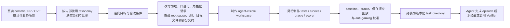

# Tencent WorkBuddy Bench：四类任务、评分与 Judge 机制精读

> 研究日期：2026 年 7 月 28 日  
> 研究对象：[官网](https://workbuddybench.com/overview.html)、[技术报告 PDF](https://workbuddybench.com/report/main.pdf)、[官方 GitHub](https://github.com/Tencent/workbuddy-bench)、[Hugging Face 数据集](https://huggingface.co/datasets/tencent/workbuddy-bench)  
> 本地报告：`D:\yantao\文件夹中转保存\Tencent WorkBuddy Bench.pdf`，30 页，创建于 2026-07-23，SHA-256 `70879822D1750CFED9D42598A42C1BF0F9D331601F177C9969B0F5818D2958B0`  
> 官网当前报告：30 页，创建于 2026-07-27，SHA-256 `1436EE370FF4505A90BC6342E0F8C4212CB7805A36BF3A24526801A70AE853CF`。两版不是同一文件；逐页文本比较显示主体方法不变，主要是排版/图例调整，并把一处笼统的 `oracle reward ≥ 1.0` 修正为 `= 1.0`。  
> 阅读口径：论文与官网用于理解官方设计；官方仓库和公开 Web/Office v1.0 数据包用于核对实际配置、rubric、Prompt 与评分代码。官方主张、公开实现、我的推断和建议分开表述。

## 核心结论

WorkBuddy Bench 把评测单位从“回答一道题”改成了“接手一个 workspace，完成工作，留下可执行、可核查的最终状态”。这是它最值得借鉴的地方。它测试的是 `模型 × Harness × 工具策略 × 上下文管理 × Verifier × 推理端点` 组成的 Agent 系统，而非脱离运行时的纯模型能力。

八个关键判断：

1. **Code、Web、Office、Security 是四种工作面，不是四个互斥的认知能力。** Code 以仓库补丁为交付物，Web 以可运行前端为交付物，Office 以文件与状态的完整交接为交付物，Security 以 PoC、IOC、规则或安全报告为交付物。需求理解、环境探索、状态管理和验证闭环贯穿四类。
2. **选题逻辑是“真实使用分布提供比例，人工重构任务”，不是直接回放真实用户 session。** 团队用内部请求 taxonomy 决定类别、角色、生命周期和难度的覆盖，再从 commit、PR、CVE 或业务场景逆向重写短而口语化的请求。论文明确说不复用原始用户 Prompt、session 或用户数据。
3. **评分不是统一的人打分，也不是统一的 LLM Judge。** Code 的正式分数来自隐藏测试；Web 由规则、LLM/VLM 和可操作页面的 Agent Judge 混合；Office 是确定性规则与证据约束的 LLM Judge 加权；Security 全程序化、没有 LLM Judge。人工主要负责出题、写测试与 rubric、设 penalty/权重、校准和审核，不在每次榜单运行里逐题手打分。
4. **Web 是最依赖模型裁判的子集。** 公开 v1.0 的 786 个评分项中，62 个是规则项，552 个是 LLM 项，124 个是 VLM 项，48 个是 Agent Judge 项；即 86.0% 的 item 由 LLM/VLM 判断。item 数量不等于最终权重，但足以说明 Web 分数对 Judge 选择高度敏感。
5. **Office 把模型裁判限制在语义质量层，结构比 Web 更稳。** 当前公开数据包有 504 条二元语义 rubric，单题 1–22 条，中位数 10 条；每题 Rule 权重为 0.70–0.95，平均约 0.794。LLM 只读被 rubric 点名的固定证据，不能改写规则结果。
6. **“Judge 到底用哪个模型”没有被论文完整回答。** 论文没有写 Judge 模型名。当前公开 Web 配置把 Judge 路由设为 `kimi-k2.7-think`，LLM/VLM 与 Agent Judge 都使用这一路由；但缺少榜单运行 manifest，不能百分之百证明论文表格当时就是该配置。Office 与 Code 的公开配置仍是 `<model-slug>`，且默认关闭，所以二者的榜单实际 Judge 模型属于**未披露**。Security 不需要 Judge 模型。
7. **Harness 是结果的一部分，而且报告已经实证展示了这一点。** 同一模型换 CodeBuddy Code 或 Claude Code 后，分数和排序都会变化；HY-3 仅改变跨轮 reasoning passback，Code 分数也会上移。榜单应读作系统配置结果，而不是“模型真实能力”的单一刻度。
8. **这套研究仍有几处需要保留意见。** 内部真实请求分布没有公开，代表性无法外部复核；Judge 偏差没有用人工标注集量化；论文一面说四类分数不可比、没有总分，另一面又在 Figure 1/官网概览展示等权 Overall；公开 Web/Office 任务把 Harbor `network_mode` 设为 `public`，与“无互联网”表述不一致；若榜单另有网络隔离配置，公开默认配置没有把它说清。

如果自己做 Agent 评测，最应该照搬的是：**从真实工作分布出发、把任务做成完整环境、把 Verifier 作为一等产品、隔离执行与评分、保存逐项证据、同时记录 Harness 与成本。** 最不应该照搬的是：把不同评分工具的四个 track 生硬平均，或在未披露 Judge 版本、Prompt、参数和人工校准结果时，把 Judge 分当作客观真值。

## 一、它究竟在评什么

### 1.1 评测对象是 Agent 系统，不只是模型

一次 WorkBuddy Bench trial 可以写成：

```text
任务请求
  + agent-visible workspace
  + Harness（CodeBuddy Code / Claude Code）
  + 模型与推理端点
  + 工具、权限、上下文窗口、compaction
  → Agent 轨迹
  → 最终 patch / artifact / workspace state / security output
  → post-episode verifier
  → task reward
```

论文的统一条件包括：200k context、统一 compaction 口径、reasoning effort 为 high、禁用 WebSearch 和 AskUserQuestion、每个模型—track—harness 组合运行三次。使用的 Harness 版本固定为 `codebuddy-code:2.109.3` 和 `claude-code:2.1.187`。HY 端点是第一方服务，其余模型经过第三方服务端点，官方也承认路由和参数处理可能影响结果。

所以，准确表述应是：

> 某模型在某个 Harness、端点、工具权限、上下文和推理配置下，对某一版任务与 Verifier 的平均得分。

它不能直接推出：

> 该模型脱离 Harness 后具有一个稳定不变的 Agent 能力值。

### 1.2 四类是 artifact/workflow boundary，不是 capability taxonomy

论文给出的理由是：现实中的 coding agent 不只改代码，也会做前端、处理办公文件和分析安全对象；四类任务有同一个抽象形状——进入 workspace、按自然语言要求产出 artifact、被解题时不可见的 Verifier 评分。

这个划分对产品评测很实用，但它混合了不同层级：

- Code、Web、Office 更接近交付物或工作介质；
- Security 更接近专业领域；
- Web 与 Code 都可能要求改代码；
- Security 的最终产物也可能是代码、结构化报告或文件；
- Office 中同样需要脚本、数据逻辑和状态更新。

因此，四类分数适合回答“Agent 在四种工作面上能否交付”，不适合回答“它有四项互不重叠的基础能力”。如果要分析能力，应在 track 之下继续看跨任务能力切片。

### 1.3 四类总览

| Track | 任务单位 | 主要交付物 | 核心问题 | 正式评分 |
|---|---:|---|---|---|
| Code | 80 | 仓库 patch、少量结构化分析报告 | 能否从口语化需求中定位仓库改动面，保持接口与回归契约 | 隐藏测试通过率 |
| Web | 70 | 可运行网页/App、测试、分析报告、转换产物 | 能否完成前端工程闭环，而非只生成可见页面 | rule + LLM/VLM + Agent Judge 的扣分式 rubric |
| Office | 50 | xlsx/docx/pptx/json/md、文件树、状态与交接材料 | 能否把混合文件工作包变成可复核、可接手的最终状态 | 每题 Rule/Judge 加权 |
| Security | 60 | PoC/flag、IOC、YARA、SOC 报告、Agent 安全 findings | 能否完成发现、复现、检测、分析与安全评估 | 每题 `scoring.py`，全程序化 |

论文反复强调四类评分工具不同，**分数不可横向比较**。这一点比四类是否都叫“百分比”更重要。

## 二、题目是怎么准备出来的

### 2.1 共享构造流程



共享原则有六项。

#### 1. 来源必须是具体对象

- Code：真实 OSS commit/PR、clean-room 重实现、合成算法或产品数据 workspace；
- Web：开源数据集、真实用户请求数据集所代表的类别与结构，再适配或新建任务；
- Office：任务规格/目标能力重构，或抽象办公工作流扩展；
- Security：历史 CVE 与人工编写的安全场景。

“具体来源”让作者能够先知道什么算完成，再把 root cause 和答案从 Prompt 中拿走。

#### 2. 真实分布只用于选题比例

论文称每类任务的 category、mode、role 和 difficulty 与内部使用 taxonomy 的 aggregate distribution 对齐，但不把原始 Prompt 或 session 放进数据集。这个选择兼顾隐私和开放发布。

边界是：内部 taxonomy、真实分布、抽样权重和偏差分析没有公开。外部读者能审核“这 260 道题是什么”，不能审核“它们是否真的代表 WorkBuddy 用户请求”。Office 官网也明确说六类场景只是 distribution-informed benchmark coverage，不是生产流量估计。

#### 3. Prompt 被刻意写得不完整

任务只给意图和少量约束，常省略：

- 目标文件或模块；
- 精确 schema、函数名或 entrypoint；
- 边界条件；
- 修改范围；
- 冲突证据的处置规则。

Agent 必须从 repo、文件、fixture、已有接口或状态中恢复上下文。它测试的是 grounded disambiguation，而不是读懂一份已经诊断完成的 issue。

但 AskUserQuestion 被统一禁用，所以它测到的是**无法询问用户时的工作区推断与隐含假设选择**，不是人机协作式需求澄清。若自己的 Agent 产品允许提问，这两种能力必须分开测。

#### 4. 解题和评分在时间上隔离

Agent 只看到 instruction 与 workspace；测试、rubric、gold、预期状态和 scorer 在 Agent 停止后才进入评分流程。这里的 hidden 是“episode 内不可见”，不是“公开发布后仍保密”。

#### 5. Gold 不是唯一正确答案

Code 的 `gold.patch` 用来证明任务可解和帮助诊断，正式分数看是否满足隐藏检查。Web、Office、Security 同样以结果契约或 rubric 为准，而不是要求输出逐字接近参考答案。

#### 6. 抗污染是一个窄主张

改写能关闭“用 Prompt 搜索到原 issue/PR”这条路径，但不能防止：

- 模型预训练见过原仓库、commit、修复代码或 CVE 文章；
- 模型从语义上认出同一问题；
- 数据集公开后，未来模型直接训练题目、测试和 gold；
- Harness 或检索工具通过其他方式找到答案。

论文也承认这些残余风险。版本化、定期换题和 canary 只能缓解，不能把公开 benchmark 变成 contamination-free。

### 2.2 Admission 与校准并没有四类完全同构

论文摘要、Figure 1 和贡献部分写了 `baseline ≤ 0.3 / oracle = 1.0` 的共同 admission gate；详细实现中，只有 Code 把两次运行的流程和阈值讲完整：

1. 未修改 baseline 跑 Verifier，要求 reward 不高于 0.3；
2. 应用 `solution/solve.sh` 或 gold patch；
3. oracle 必须得到 1.0。

其他三类披露的是：

- Web：对 evidence-backed rubric 持续校准，公开数据含 task-specific oracle/invariant；
- Office：用保存的 submissions 回放，检查规则覆盖、语义证据是否充分、优秀有效输出是否被误伤；
- Security：用 renamed input、tamper、encoding、decoy 等反作弊测试加固 scorer。

因此，“四类都通过同一个数值 gate”是官方总体主张；“公开材料足以逐类验证同一个 gate”则不成立。自己做评测时，应把每一题的 baseline、oracle、mutant 和 alternative-valid-output 结果写进可审计 manifest，而不是只在论文里声明。

## 三、Code：测的是仓库级 grounding 与契约完成

### 3.1 为什么测这些任务

[Code 子集](https://workbuddybench.com/code.html)刻意避免又做一套以 bug fix 为主的 SWE-bench。80 题按 18 个细类组织，并合并成六个使用域：

| 使用域 | 题数 | 主要在测什么 |
|---|---:|---|
| Feature & API | 18 | 新功能、接口扩展、schema/API contract、兼容性 |
| Code engineering & understanding | 18 | 仓库理解、重构、性能、可靠性、安全加固、改动面判断 |
| Test & reliability | 12 | 回归测试、边界条件、故障路径、生产行为 |
| Algorithm engineering | 12 | 指标、特征流水线、排序/去重、确定性与评估脚本 |
| Bug fix | 10 | 从一句症状定位真实回归并最小修复 |
| Product & data analytics | 10 | 将业务口径转成计算、报告与结论 |

角色分布是 developer 30、algo 19、PM 15、ops 10、QA 6。角色维度的价值在于，不同协作方会以不同语言提供约束：

- developer 说预期代码行为；
- algo 说指标、数据和稳定性；
- PM 说业务结果与口径；
- QA 说回归边界和不得修改的面；
- ops 说线上可靠性、确认顺序和失败恢复。

这使 Code 同时测代码实现和“把非工程规格翻译成工程契约”的能力。

### 3.2 题目来源

论文 Table 3 给出的精确构成为：

- Family A：34 题，真实 OSS snapshot，gold patch 是真实人类修复；
- Family B：24 题，clean-room `*_like` 公共 API 重实现，包含 4 个跨语言转为 Python 的任务；
- Family C：22 题，完全合成 workspace，其中 algo 12、PM 10。

这三个数加总为 80。官网另有“约 34 + 约 28 + 约 22”的表述，会加总到约 84；应以论文精确表格的 34/24/22 为准。官网还写过“every task anchored to a real commit/PR”，也与论文中 46 个无 upstream code 的任务不一致。

难度主要按仓库复杂度，而不是 patch 长度：

- L2 4、L3 27、L4 40、L5 9；
- editorial difficulty：easy 7、medium 31、hard 42；
- 典型失败是长时间修改测试直至超时，或在大仓库中定位到完全错误的文件。

### 3.3 能力链

一题 Code 实际串联了：

1. 从口语化需求提取显式约束；
2. 探索目录、调用关系和已有接口；
3. 判断真正的修改面；
4. 编写最小而完整的 patch；
5. 对齐隐式的函数名、参数、路径、schema 与输出契约；
6. 运行测试、诊断失败、避免测试逃逸；
7. 控制回归风险与无关改动。

PM 的 checkout experiment 示例尤其能说明它不是单纯 coding：代码都可以正常运行，分差来自 Agent 是否把“不要算很久以后的购买”恢复为 attribution window。`api_contract` 则相反，语义大体正确但漏一个字段，也会因既有接口契约失败。

### 3.4 正式打分

每题 reward 是隐藏检查的 `test_pass_rate`：

```text
Code run score = (1 / 80) × Σ task_test_pass_rate
最终报告再对 3 次独立 run 取平均
```

80 题有三种 Verifier：

- 22 题：注入 pytest，解析 JUnit XML；
- 54 题：手写 boolean functional assertions，不依赖 pytest 或网络；
- 4 题：`repo_understanding`，检查 `analysis.json` 中的事实和证据引用。

正式排名只用隐藏测试分。结构 diff、file-hit-rate、task aggregate pass rate 和 LLM Judge 都是诊断信号。

### 3.5 Code 的 LLM Judge 是什么

官方代码中的 [LLM Judge](https://github.com/Tencent/workbuddy-bench/blob/main/src/workbuddy_bench/scorer/llm_judge.py)是一次 white-box 诊断：

- 输入：instruction、metadata、gold patch、Verifier tests/code、agent patch、测试结果与失败输出；
- 不按 patch 相似度打分；
- 把“实现语义正确”与“测试隐含接口对齐”分开；
- 输出七维 0–1 分数和 failure mode。

权重是：

| 维度 | 权重 |
|---|---:|
| intent coverage | 0.30 |
| semantic correctness | 0.30 |
| interface alignment | 0.15 |
| test-implied edge cases | 0.10 |
| integration fit | 0.05 |
| regression risk | 0.05 |
| code quality | 0.05 |

它还输出 `interface_mismatch_only`、`hardcoded_tests`、`test_only_escape`、`missing_artifact` 等诊断标签。默认 fallback 是 `max_tokens=2048`、`temperature=0.1`，但模型配置可覆盖。

**Judge 模型：未披露。** [Code bench config](https://github.com/Tencent/workbuddy-bench/blob/main/configs/bench/wb-bench-code-v1.0.yaml)默认 `enabled: false`，模型只是 `<model-slug>`。这不影响 Code 正式分数，但意味着官网展示的参考 Judge 分不能从论文和默认配置中完整复现。

## 四、Web：测的是可运行前端的工程闭环

### 4.1 为什么不是只测“写页面”

[Web 子集](https://workbuddybench.com/web.html)的目标是把前端生成、修改、分析、测试和验收放在同一任务空间。七类任务为：

| 类别 | 题数 | 主要能力 |
|---|---:|---|
| Page interaction | 21 | 控件行为、用户流程、状态同步、恢复与持久化 |
| Data visualization | 15 | 数据绑定、指标语义、图表一致性、来源到输出的证据链 |
| Visual design | 9 | 信息层级、布局、可读性、响应式与视觉完整性 |
| Analysis & reporting | 7 | 阅读前端项目证据并形成可行动的分析交付物 |
| Code & testing | 7 | 测试生成、构建/运行信号、测试是否绑定真实行为 |
| Page implementation | 6 | 按要求交付可运行页面 |
| Document conversion | 5 | 将源材料转换为前端可用产物并保留结构和内容 |

它还沿两个正交轴分层。

开发生命周期：

- From Scratch 35；
- Bug Fix 8；
- Extend Existing 8；
- Review & Analysis 7；
- Test Generation 7；
- Format Conversion 5。

交互与状态：

- No Interaction 25；
- Light Interaction 8；
- Single-flow State 15；
- Multi-step Workflow 9；
- Persistence/Offline/Cross-state 13。

45/70 题包含交互或状态要求。这个设计在问：Agent 能否把数据源、运行时状态、显示、持久化和最终 payload 闭合，而不是只把首屏渲染出来。

### 4.2 题目和 evidence 怎么准备

每题有明确 artifact contract，例如 `/workspace/www/index.html`。只在聊天里说“已完成”而没有在声明路径留下可运行产物，直接失败。题目可以提供 Markdown、JSON、YAML、CSV、代码或样式 token 等 public assets；运行时不得依赖未打包的相对路径或外部资源。

作者把要求拆成 item 级 rubric。每个 item 预先固定：

- `question`；
- `annotation_guide`；
- `fail_when`；
- `judge_type`；
- `severity` 与 `penalty`；
- `evidence_required`；
- public assets、DOM、源码、截图、workflow trace 或 Agent evidence。

以 Snake 示例为例：

- 难度档位是否齐全：LLM；
- timing 是否符合参数表：LLM；
- 输入 buffer 是否允许合法双转向、拒绝反向：Agent Judge；
- fresh round 是否遵循固定 trace：LLM；
- 撞尾部旧位置是否误判：Agent Judge；
- best score 刷新后是否保留：Agent Judge。

这一设计按问题的可观测性选择 Verifier，而不假设 LLM 能统一判断所有要求。

### 4.3 公开 v1.0 的实际评分构成

我对公开 Web archive 的 70 个 `verify-context/cases/*.json` 做了全量统计，结果与论文总数一致：

| Judge type | item 数 | 占 786 项 |
|---|---:|---:|
| Rule | 62 | 7.9% |
| LLM | 552 | 70.2% |
| VLM | 124 | 15.8% |
| Agent Judge | 48 | 6.1% |
| 合计 | 786 | 100% |

其中 6 个 fatal、470 个 major、304 个 normal、6 个 minor；对应 penalty 为 1.0、0.3、0.2、0.1。单题含 5–19 个 item，中位数 11.5，平均 11.23。

注意：item 比例不等于分数贡献比例，因为 penalty 不同、同题失败可能在 0 分处截断。但它说明 Web 的主要判定面由模型 Judge 承担。

### 4.4 三类 Judge 各自做什么

#### Rule Judge

用于能确定判断的硬条件：

- 文件和输出路径；
- JSON/schema/字段；
- build/test/precheck 信号；
- 任务专属结构化 assertion。

#### LLM/VLM Judge

LLM 读取文本、代码、报告、结构化 evidence、DOM summary；VLM 额外读取截图。它判断：

- 内容是否完整；
- 数据与来源是否一致；
- 语义是否正确；
- 布局、视觉一致性、关键信息是否可见；
- 移动端或交互前后截图是否支持结论。

#### Agent Judge

这是一个会操作产物的 evaluator agent。它在 sandbox 中：

- 读源码与 public assets；
- 用 Playwright 打开声明 URL；
- 点击、拖拽、刷新、等待；
- 保存 DOM 与 screenshot evidence；
- 判断流程、状态、持久化和跨状态一致性。

公开实现默认最多 40 turns，由另一个模型通过 CodeBuddy CLI 执行自动验收。

### 4.5 Web 评分公式

每个 item 返回 pass/fail：

```text
若任一 fatal item 失败：
    task_score = 0
否则：
    task_score = max(0, 1 - Σ failed_item.penalty)

Web overall = 70 个 task_score 的等权平均
再对 3 次 run 取平均
```

这种设计直观，但有三个统计后果：

1. 同题 rubric 多、少会改变分数灵敏度；
2. 高度相关的 rubric 可能重复扣同一缺陷；
3. 到达 0 分后，更多失败不再可区分。

因此应同时看 item-level failure profile，而不能只看一个 Web 总分。

### 4.6 Web Judge 模型与 Prompt

[公开 Web 配置](https://github.com/Tencent/workbuddy-bench/blob/main/configs/bench/wb-bench-web-v1.0.yaml)写明：

```yaml
llm_judge:
  enabled: true
  mode: in_container
  model: kimi-k2.7-think
```

LLM/VLM 与 Agent Judge 都从同一个 `WORKBUDDY_VERIFIER_LLM_MODEL` route 取模型，所以公开复现默认使用 `kimi-k2.7-think`。固定 LLM/VLM 请求使用 `temperature=0`，并在适用时要求 JSON response format；VLM 请求加入筛选后的截图。Agent Judge 通过 `cbc --model <route> --max-turns 40` 运行。

但论文没有写 Judge 名，也没有发布论文榜单的 resolved manifest。最严谨的结论是：

- **当前公开 v1.0 默认：Kimi K2.7 Think；**
- **论文榜单实际 Judge：公开材料没有给出独立运行证据，只能推定，不能确认。**

## 五、Office：测的是可审计的文件工作流交接

### 5.1 它不是 Office GUI benchmark

[Office 子集](https://workbuddybench.com/office.html)让 Agent 在本地 workspace 读取 xlsx、csv、pdf、docx、JSON、Markdown、文件树和 local state，产出新的工作簿、报告、结构化记录、状态文件或 handoff material。

它主要测：

1. 混合格式解析与字段归一；
2. 跨文件 key matching、alias resolution 与 source binding；
3. 时间窗口、状态依赖、规则优先级；
4. 多个交付物之间的一致性；
5. 文件、目录与状态的正确 mutation；
6. 冲突、缺失和例外是否被保留，而非擅自补猜；
7. 结果是否能被下一位同事直接使用和审计；
8. 是否遵守不得修改源文件、不得访问 live service 等执行边界。

论文明确限制了适用范围：当前 Office 是 text-first，不要求 OCR、VLM、像素布局判断或原生桌面 GUI 操作。因此它更准确地说是**文件系统中的办公工作流 benchmark**，不是 Excel/PowerPoint/浏览器界面的 GUI Agent benchmark。

### 5.2 任务覆盖

两条构造路线：

- 30 题：从 task specifications 与 target capabilities 重构；
- 20 题：从抽象 office workflows 扩展。

三个广义任务族：

- data/spreadsheet/structured processing 24；
- document/report/presentation 17；
- workspace automation/stateful workflow 9。

六个诊断场景：

| 场景 | 题数 | 典型能力 |
|---|---:|---|
| Data & finance analysis | 16 | 聚合、指标、period、单位、来源与异常 |
| Documents & presentations | 11 | 基于现有材料修改、内容同步、读者可用性 |
| Reconciliation & back office | 8 | 多源对账、冲突保留、状态与记录闭合 |
| Engineering & tool workflows | 5 | CLI/API 文档、验证、文件或工具包交付 |
| Stateful workflows | 5 | checkpoint、sync、phase gate、恢复与历史 |
| Compliance & evidence | 5 | 证据组织、只读边界、审计链与安全约束 |

输出是 multi-label：xlsx 24、Markdown 20、JSON 15、text 6、state 5，另有 pptx、csv、filesystem 等。难度为 easy 13、medium 24、hard 13。

论文用 `hospital_bed_utilization` 解释难度：跨 ward 配置、admission log 与 policy table 对 key、日期、报告期和 denominator，再保持明细与汇总一致。不过我在 2026-07-28 下载的公开 Office v1.0 50 题目录中没有找到该 task id 或对应 instruction。这可能是发布前后替换或版本漂移，但 archive 仍叫 v1.0；它说明报告、任务清单和 checksum 应绑定为不可变 release manifest。

### 5.3 Rule 层检查什么

Rule 是人写的确定性程序，逐项检查：

- 规定文件是否存在、是否能解析；
- sheet、列、schema、行数、类型与数值；
- cross-file relation；
- source row/section/evidence link；
- 文件 diff、state transition、side effect；
- 是否修改了禁止修改的文件；
- trace、mock environment 或 runtime boundary。

这层回答：“文件和状态是否真的改对了？”

### 5.4 LLM Judge 层检查什么

每个 semantic rubric 是一个二元问题，Judge 只读取 rubric 点名的 artifact evidence。它主要判断：

- policy fit；
- exception handling；
- summary/detail 的 scope 是否一致；
- 结论与 evidence 是否一致；
- source trace 是否足以复核；
- handoff 是否清晰、可行动；
- deliverable 是否像真实交付物，而不是过程笔记。

公开任务中的 rubric 不只写 `question/pass/fail`。较完整的任务还写：

- `purpose` 与 `discrimination_target`；
- `public_requirement_source`；
- `concrete_signals`；
- `acceptable_pass_output`；
- `near_miss_fail_criteria`；
- `scope_limits`；
- `not_score_chasing_rationale`；
- `fairness_rationale`。

这是一项值得借鉴的 rubric 工程：它要求作者说明“为什么这条 rubric 能区分能力、为什么不只针对某个模型、什么相似答案也应通过、哪些证据不能用”。

三个例子：

- 投研资料抽取：主表与 JSON 是否对同一实体、周期、状态和纳入范围保持一致；缺失目标价是否被错误推断；逐行 source trace 是否足够；
- 董事会材料更新：采购、冻结、培训、风险降级和复盘信息是否形成连贯治理故事；关键决策和日期是否对董事可见；是否保持 board-facing concise；
- 日历到待办同步：summary 与最终 task state/sync history 是否一致；取消、来源缺失、重复抑制和手工锁定是否按公开政策解释。

### 5.5 公开 v1.0 的 rubric 与权重

我解析了 50 个 `tests/judge.yaml`：

- 共 504 条 semantic rubric；
- 每题平均 10.08 条，中位数 10，最少 1，最多 22；
- Rule 权重分布：

| Rule weight | 任务数 |
|---:|---:|
| 0.70 | 8 |
| 0.75 | 1 |
| 0.80 | 33 |
| 0.85 | 6 |
| 0.90 | 1 |
| 0.95 | 1 |

Rule 权重平均约 0.794，LLM 权重平均约 0.206。这个结构让确定性结果占主导，但 8 个 Rule weight=0.70 的任务仍有 30% 分数来自 Judge。

### 5.6 Office 评分公式

对任务 \(i\) 的一次 trial：

```text
R = passed_rule_checks / N
J = passed_binary_rubrics / K
S = w_i × R + (1 - w_i) × J
```

其中 \(w_i\) 是每题预配置的 0.70–0.95。先把同一任务三次 trial 平均，再对 50 个 task mean 等权 macro-average。Rule 和 Judge 子分单独保留。

错误处理：

- 某个 evidence extraction 或 Judge call 失败：该 rubric 记 0，其他 rubric 继续；
- Judge 输入超长或全部 API call 失败：保留 Rule 与错误状态，combined trial 记 unavailable，并从聚合中排除。

“排除 unavailable trial”会改变有效样本集合。严谨榜单应同时报告每个模型的 available-trial count，以及缺失是否与模型输出长度或 artifact 类型相关。

### 5.7 Office Judge 模型与 Prompt

[公开 Office bench config](https://github.com/Tencent/workbuddy-bench/blob/main/configs/bench/wb-bench-office-v1.0.yaml)是：

```yaml
llm_judge:
  enabled: false
  mode: in_container
  model: <model-slug>
```

论文榜单报告了 Combined、Rule 和 Judge 分，说明榜单 job 必然另行启用了 Judge 并配置模型；但这个 resolved job/manifest 没有公开。因此：

> Office 榜单 Judge 的实际模型、版本、端点和采样参数均未披露。

Office 请求 body 只包含 `model` 和一条 user message，没有在数据包实现里显式设置 temperature、max tokens 或 JSON response format；输出格式错误时会再发 repair Prompt。故即使 Prompt 已公开，Judge 的重现性仍受未披露 endpoint default 影响。

## 六、Security：测的是安全团队任务，而不是修复漏洞

### 6.1 为什么单列 Security

[Security 子集](https://workbuddybench.com/security.html)把交付目标放在安全发现、复现、检测与评估：

- 能否像安全研究员一样找到漏洞路径并安全复现；
- 能否像逆向/反病毒工程师一样提取 IOC、写 YARA；
- 能否像 SOC analyst 一样分类、排序和形成报告；
- 能否像 AI red team 一样测试 tool-using agent 的攻击面。

60 题分成六个细域、四个 block：

| Block | 题数 | Discipline | 主要产物与能力 |
|---|---:|---|---|
| Vulnerability discovery & exploitation | 32 | Red | 白盒源码审计、黑盒二进制利用、Web exploit、PoC/flag |
| Malware analysis | 14 | Blue | reversing、IOC、YARA |
| Security operations | 8 | Blue | SOC triage、检测规则、分类与优先级 |
| Agent security | 6 | Red | 攻击链、结构化 findings、CVSS |

红队 38、蓝队 22。难度刻意偏 hard。

### 6.2 具体能力

#### 白盒 CVE 审计

基于 binutils、curl、nginx、vim、jq、fluent-bit 等真实历史 CVE。采用两阶段 gate：

1. `find-vuln`：读源码、追踪 data flow、定位危险路径；
2. `poc-verify`：达到第一阶段阈值后，构造能在 sandbox 中稳定触发 ASAN crash 的最小 PoC。

它同时测 source navigation、漏洞机理、输入构造和安全复现。

#### 黑盒/Web exploit

面向 ELF、服务和特定技术，例如 House of Apple2、ECDSA nonce reuse。重点是从行为和环境中恢复利用条件，而不是复述漏洞定义。

#### Malware

输出 IOC 或 YARA。YARA 不只测命中，还要求 zero false positive，避免把“全部匹配”当成高分策略。

#### SOC

对 alert/report 做分类与排序，分别用 macro-F1 和 Kendall-tau 对照 reference。它把“哪些告警是什么”与“先处理什么”分开。

#### Agent security

六题覆盖：

1. A2A injection；
2. ReAct chain hijacking；
3. multimodal prompt-chain injection；
4. tool-schema confusion；
5. summarize-tool exfiltration；
6. delayed trigger。

输出需要说明是否抵抗 injection、是否识别 tool misuse/data leak、攻击链和 CVSS severity。

### 6.3 评分与反作弊

每题有独立 `scoring.py`，在隔离容器内直接写数值 reward。论文给出统一抽象：

```text
task_reward = w1 × artifact + w2 × correctness + w3 × robustness
Security overall = 60 个 task_reward 的等权平均
再对 3 次 run 取平均
```

具体 scorer 按任务变化：

- exploit：PoC/flag；
- whitebox：位置/证据阈值 + ASAN 复现；
- malware：IOC ground truth；
- YARA：match rate + zero-FP；
- SOC：macro-F1 + Kendall-tau；
- Agent security：结构化字段、证据与 severity。

五层 anti-cheat：

1. banned-literal scan；
2. renamed-input test；
3. overlay/tamper test；
4. encoding-dependence test；
5. low-weight decoy fields。

**没有 LLM Judge，也没有 Judge Prompt 或 Judge 模型。** 人负责设计 scorer 和 ground truth，榜单运行全自动。相同输出重复评分应得到相同结果；候选 Agent 本身仍有随机性，所以运行三次。

## 七、到底是人打、规则打，还是模型打

### 7.1 一张表说清楚

| Track | 人在何处参与 | 运行时正式评分 | LLM 影响 | Judge 模型公开度 |
|---|---|---|---|---|
| Code | 选 commit/scenario、改写 Prompt、写 tests/gold、校准 | hidden tests | 只影响诊断参考分 | 未披露，默认关闭 |
| Web | 写 item、guide、fail condition、penalty、evidence plan，校准 | rule + LLM/VLM + Agent Judge | 高，676/786 为 LLM/VLM，另有 48 Agent items | 当前默认 `kimi-k2.7-think`；论文榜单未明确 |
| Office | 写 Rule、artifact extractor、binary rubrics、task weight，回放审核 | Rule/Judge weighted blend | 中，题目级 5%–30% 分数 | 未披露，公开配置占位且默认关闭 |
| Security | 写 scorer、ground truth、PoC gate、anti-cheat | programmatic `scoring.py` | 无 | 不适用 |

没有证据表明榜单结果由人逐题打分。人工是**评价标准的设计者和校准者**，不是每次 trial 的在线裁判。

### 7.2 人工 rubric 不等于人工评分

一个 rubric 有两层：

1. 人写的评价合同：问题、通过/失败条件、证据范围、权重；
2. 执行这个合同的 evaluator：程序、一次 LLM call、VLM call 或 Agent Judge。

WorkBuddy Bench 的 Web/Office 使用了大量人工定义 rubric，但最终 verdict 仍由模型自动生成。对外沟通时，不能把“rubric-based”自动翻译成“human-evaluated”。

### 7.3 没有披露的人工质量信息

论文没有提供：

- 每条 rubric 有几位作者/审核者；
- 是否双人独立标注和 adjudication；
- 人类对同一 artifact 的一致性；
- Judge 与人类 gold verdict 的 accuracy、false pass、false fail；
- 不同 Judge 模型之间的一致性；
- self-preference 或同模型家族偏差；
- Judge Prompt/version 变化对榜单的敏感性。

因此，Web/Office 的 Judge 层应视为**公开可审计但尚未完成人类有效性校准披露的测量工具**。

## 八、Judge Prompt 到底长什么样

以下是公开实现的结构等价压缩版。省略了很长的 artifact/test 内容，不改变判定逻辑。

### 8.1 Code white-box diagnostic Prompt

来源：[仓库 `src/workbuddy_bench/scorer/llm_judge.py`](https://github.com/Tencent/workbuddy-bench/blob/main/src/workbuddy_bench/scorer/llm_judge.py)

```text
You are a strict but fair white-box evaluator.

Distinguish semantic implementation quality from benchmark contract alignment.
Use:
- user instruction
- task metadata
- gold patch
- verifier tests/code
- agent patch
- test result/failure

Do not judge by patch similarity.

Score 7 dimensions in [0,1] with fixed weights.
Choose one failure mode.
Return strict JSON containing:
scores, failure_mode, ambiguity flag,
adapter-likely-fix flag, interface mismatch,
evidence and rationale.

White-box context:
{context_json}
```

Judge 看到 gold 与 hidden tests，适合诊断“语义对但接口错”，但不适合当独立 blind correctness signal。这也是它不进入正式 Code 排名的正确原因。

### 8.2 Web LLM/VLM item Prompt

公开数据包内部路径：

- `shared/verifier/container/web_verifier/llm_judge/prompts/strict_json_system.md`
- `shared/verifier/container/web_verifier/llm_judge/prompts/item_judge.md`

```text
System:
You are a strict binary evaluator.
Return exactly one compact JSON line:
{"verdict":"pass|fail","reason":"..."}

User:
Case, item, dimension, question, annotation guide
Item-specific fail conditions

Oracle hints
Public asset excerpts
Rule evidence summary
Rendered visual evidence
Workflow/action trace evidence
Artifact excerpt

Judge this exact item, not the whole task.
Do not infer absence from a truncated excerpt.
For visual/responsive items, screenshots are primary;
missing or insufficient screenshot evidence => fail.
Return pass/fail with an evidence-grounded reason under 40 words.
```

VLM item 使用同一文本模板，再向 user content 加入截图。固定请求设 `temperature=0`；文本请求通常要求 JSON response format，带图请求默认不强制 native JSON format。

### 8.3 Web Agent Judge Prompt

公开数据包内部路径：

- `shared/verifier/container/web_verifier/agent_judge/prompts/base.md`
- `steps_browser.md` / `steps_artifact.md`

```text
You are a strict rubric judge for one Web-Bench item.

Inspect source and public assets.
For a runnable page:
  write a small Playwright script,
  open the canonical served URL,
  drive required clicks/drag/refresh,
  save DOM/screenshot evidence.
For a document/test package:
  inspect files and run lightweight parsers/scripts.

Compare the observed result with this one rubric.

Final line only:
{
  "verdict": "pass|fail|review",
  "confidence": 0.0-1.0,
  "evidence_paths": [...],
  "reasoning": "<=200 chars"
}
```

它最多 40 turns。只有成功解析的 pass/fail 会提交；`review` 或执行失败不会被当成有效 pass。

### 8.4 Office binary rubric Prompt

公开数据包内部路径：`shared/verifier/llm.py`

```text
你是 WorkBuddy Bench 的 LLM-as-Judge。
请只基于给定 evidence 判断单条 rubric，
不要猜测 artifact 中没有出现的内容。

## Task instruction
{instruction}

## Rule reward
{complete_rule_result}

## Artifact evidence
{only_the_artifacts_referenced_by_this_rubric}

## Rubric
ID / Question / Pass criteria / Fail criteria

输出严格 JSON：
{"id":"...","verdict":"pass|fail","score":1.0|0.0,"reason":"..."}

证据不足 => fail。
```

每条 rubric 单独调用一次。缺少 required evidence 时，代码会在调用模型前直接把该 rubric 记为 fail。格式错误会触发一次 repair Prompt。

一个值得注意的设计点是：Office Judge 会看到完整 Rule result。官方保证它不能修改规则分，但这两个 channel 并非信息独立；Rule 结果可能锚定语义判断。如果自己的设计想让语义 Judge 成为独立证据，应做“Judge 看/不看 Rule result”的 ablation。

## 九、方法论审计：强项、边界与公开材料不一致之处

### 9.1 真正的强项

#### 强项 1：评分对象是最终状态

Code 看 patch 后的行为，Web 看运行 artifact，Office 看文件与 state，Security 看可复现 evidence。它显著减少“聊天回复很漂亮、实际什么都没交付”的虚高。

#### 强项 2：Verifier 与任务一起设计

作者从 concrete origin 同时逆向目标、workspace、证据和评分条件，再定稿 Prompt。这更接近 eval-driven environment design。

#### 强项 3：区分可程序化与不可程序化要求

Office 将 Rule 与 Judge 分开，Web 将 rule/LLM/VLM/agent 分开，Security尽量全部程序化。这比一个 LLM 对整份结果打一分更容易审计。

#### 强项 4：Harness sensitivity 被纳入结果

双 Harness 同时跑，证明 Harness 不是中性管道。这一点对 Agent benchmark 比多测几个模型更重要。

#### 强项 5：开放到 task 与 grader

公开任务、环境、测试和评分代码允许外部检查具体 failure，而不只看榜单数字。开放会带来污染，但仍优于无法审计的闭源生产 benchmark。

### 9.2 需要保留意见的地方

#### 1. “distribution-informed”不可外部验证

内部使用 taxonomy、真实请求占比、抽样过程、去重和长期漂移均未披露。它只能证明“作者有用内部信息校准”，不能证明“任务集客观代表市场或所有 WorkBuddy 用户”。

#### 2. 四类 Overall 的口径自相矛盾

技术报告摘要、正文和 scoring section 明确说四类评分工具不同、分数不可比、没有 suite-wide average；但 PDF Figure 1 展示了 `Overall Score` 与排名，官网 Overview 的 Figure 1 caption 又称 four equally-weighted tracks。

如果 Overall 是四列简单平均，它隐含：

- 四个工作面商业价值相同；
- 四种评分工具的 1 分具有相同意义；
- 任务难度和测量噪声已经可比。

公开材料没有证明这三点。研究解读应以分 track、分 Harness 榜单为准，不使用 Overall 做能力结论。

#### 3. Judge 模型披露不足

- Web 当前配置有模型 slug，但论文没有确认榜单 manifest；
- Office 榜单需要 Judge，公开默认却关闭且模型占位；
- Code 官网展示参考 Judge 分，默认配置也没有模型；
- 没有 judge model card、endpoint、Prompt hash 或人工校准表。

这使 Web/Office 结果无法做到“精确重放同一个 Judge”。

#### 4. Judge bias 被承认，但没有量化

Web 绝大多数 item 由模型判断。若 Kimi K2.7 同时评 Kimi 候选模型，存在同家族 self-preference 风险；Agent Judge 又通过 CodeBuddy CLI 运行，可能引入 Harness 风格偏好。论文只把它列为 limitation，没有给出 judge swap、human audit 或 ensemble 结果。

#### 5. “无互联网”与公开 task config 不一致

论文 Figure 1 和 Web/Office 描述强调 no internet/live data。可是我检查公开 Web 和 Office 的全部 120 个 `task.toml`，`[environment].network_mode` 都是 `public`。Harbor [Task Structure 文档](https://www.harborframework.com/docs/tasks)说明 `public` 是默认公共网络模式，真正禁网应使用 `no-network`，或使用 `allowlist` 只放行模型端点。

可能存在三种解释：

1. 榜单 job 或远端 sandbox 另有未公开 egress policy；
2. “无互联网”只指禁用 WebSearch 与禁止任务依赖外部服务，不是容器级网络隔离；
3. 公开包的网络配置与论文陈述存在错误。

公开默认配置不足以确定是哪一种。自己的评测必须把实际 egress policy、allowlist 和网络访问日志随 run manifest 一起保存。

#### 6. 口语化欠规约与禁用提问存在张力

真实工作中的合理行为经常是向用户澄清；该 benchmark 刻意欠规约，却禁用 AskUserQuestion。它因此奖励“从 workspace 猜中作者隐含契约”，不一定奖励最安全的人机协作策略。

建议把任务拆成两个 protocol：

- no-clarification：必须独立推断；
- clarification-enabled：允许有限问题，按信息价值、轮次成本和最终成功一起评分。

#### 7. 开放版本与报告有漂移迹象

用户本地 PDF 与官网当前 PDF 的 hash 不同，官网文件在四天后重新生成，但 URL 与报告标题没有版本号。主体文字基本一致，当前版把 admission 表述从 `oracle ≥ 1.0` 收紧为 `= 1.0`，并调整了 Figure 1 的 Judge 图例。除此之外，Office 示例任务未在当前 v1.0 找到，Code 的来源数量也在官网和论文间不一致。开放 benchmark 应固定：

- release commit；
- dataset archive SHA；
- task-id manifest；
- prompt/test/rubric hash；
- scorer/Judge version；
- leaderboard job manifest。

“v1.0”这一名字不足以证明两个时间点拿到的是同一个测量工具。

#### 8. 失败类型没有在榜单总分里充分分离

Security 的 refusal 单列了少量统计，但其他 track 的：

- timeout/budget exhaustion；
- infra/build failure；
- missing artifact；
- judge unavailable；
- policy refusal；
- semantic wrong answer；
- contract mismatch

仍可能汇聚为低分或 0 分。对 Agent 产品决策而言，这些失败的修复责任完全不同，应和 reward 同时报告。

## 十、如果自己要做 Agent 评测：一套可直接执行的蓝图

### 10.1 先定义评测对象

先选一个，不要混写：

1. **模型能力评测**：Harness 固定，尽量减少系统差异；
2. **Agent 产品评测**：模型、Harness、Skills、Memory、Context、工具和权限作为一个整体；
3. **组件消融**：固定其余条件，替换模型、Harness、Context strategy、Verifier 或工具。

WorkBuddy Bench 的榜单实质是第 2 类，并用双 Harness 做了一部分第 3 类。

### 10.2 从真实工作构造 task universe

建议用五个轴，而不是先想几道“有趣题”：

| 轴 | 示例 |
|---|---|
| Job/role | 开发、分析、运营、销售、审核、支持 |
| Lifecycle | 新建、修复、扩展、复核、迁移、恢复 |
| Artifact/state | 代码、网页、表格、报告、系统状态、消息 |
| Dependency | 单文件、多文件、跨系统、时间状态、外部工具 |
| Consequence | 可逆、数据损坏、权限、安全、客户影响 |

先在真实 session 上只做去标识化 taxonomy 和统计，再按分布抽样；发布任务时使用重构场景，不直接泄露 session。

同时保留两套分布：

- production-weighted：回答整体产品成功率；
- stress/challenge：过采样高风险和长尾，回答能力边界。

不要把二者混成一个分数。

### 10.3 先做 Verifier，再定稿 Prompt

每题至少需要：

```yaml
task_id:
source_family:
role:
lifecycle:
workspace_snapshot_hash:
instruction:
allowed_tools:
network_policy:
budget:
required_artifacts:
deterministic_checks:
semantic_rubrics:
state_transition_checks:
fatal_conditions:
oracle_solution:
alternative_valid_solutions:
mutant_outputs:
```

构造顺序建议是：

1. 写真实完成条件；
2. 写可确定判断的 checks；
3. 写至少一个 oracle；
4. 写几个“看似合理但应失败”的 mutants；
5. 验证至少两个不同实现路径可以通过；
6. 最后把请求改写为目标真实用户会说的话。

这能防止 Prompt 暗中迎合唯一 gold。

### 10.4 Verifier 的路由原则

```text
能程序化验证 → Rule/Test
需要看静态语义 → evidence-grounded LLM
需要看像素/布局 → VLM + 固定截图协议
需要操作后才能知道 → Agent Judge / scripted browser
高风险且无法可靠自动化 → 人工复核或不进入自动总分
```

建议让确定性层掌握主要 score mass。对高风险业务，可用以下起始目标：

- deterministic score mass ≥70%；
- semantic Judge ≤30%；
- fatal 安全/数据边界尽量程序化；
- Judge 结论不能改写 Rule outcome。

这是设计建议，不是普适定律。视觉创意任务会需要更高 Judge 比例，但应以更强人工校准换取。

### 10.5 Judge 上线前的最低校准

建立包含 pass、near-miss、hard negative、风格差异和同家族模型输出的人工 gold set。至少报告：

- binary accuracy / balanced accuracy；
- false pass 与 false fail；
- Judge—human agreement；
- 两位人类之间的一致性；
- 换 Judge 模型后的 score shift；
- 候选模型与 Judge 同家族/异家族切片；
- Prompt、temperature、seed、response format 与 retry policy。

可采用的起始门槛：

- Judge—human agreement ≥90%，或 Cohen's \(\kappa ≥0.8\)；
- 高风险 rubric false pass <5%；
- Judge swap 不应改变核心排序，若改变则必须分 Judge 报告；
- 所有 disputed 或 low-confidence item 进入人工 audit。

这些门槛应按业务损失函数再校准。

### 10.6 评分与聚合

建议同时保留四层，不要只报 Overall：

1. item verdict 与 evidence；
2. task score；
3. capability slice；
4. production-weighted track score。

跨异质 track 不直接平均。若业务必须有总分，应明确使用：

```text
Business Utility Score
= Σ production_frequency_i
  × task_success_i
  × consequence_weight_i
  × quality_gate_i
```

其中权重来自真实业务频率和失败代价，不来自“每个 track 看起来都重要”。

多次运行时至少报告：

- mean、median、标准差/置信区间；
- success@1 与 pass^k/majority；
- timeout、refusal、infra、judge-unavailable 的独立计数；
- token、turn、wall time、tool calls、成本；
- 每题有效 trial 数。

### 10.7 把 Harness 和 Context 当实验变量

对于产品评测，记录：

```text
model ID / provider / endpoint / region
harness name + build
system prompt + instruction policy
context window + compaction threshold
tool/skill list
memory/context sources
network and filesystem permissions
reasoning effort + sampling parameters
budget and timeout
judge model/config
dataset + scorer hash
```

如果要判断模型迁移价值，做最小 factorial：

- 同 Harness 换模型；
- 同模型换 Harness；
- 同系统开/关某个 Context/Skill；
- 同输出换 Judge；
- 同 task 开/关澄清问题权限。

这样才能把“模型强”“Harness 适配好”“Context 给对了”“Judge 偏好该格式”分开。

### 10.8 污染与版本策略

建议采用：

- private rolling holdout：正式选型使用；
- public retired set：社区复现和调试使用；
- 每版 immutable archive + SHA；
- task/source/test/Judge manifest；
- 重写相似度与 repo/CVE exposure 检查；
- canary 与异常性能监控；
- 固定 refresh cadence；
- 发现疑似污染时保留旧版结果，不静默替换题目。

重写 Prompt 只能解决 contamination 的一个入口，不能替代滚动私有集。

## 十一、如何评价 WorkBuddy Bench 本身

| 维度 | 判断 | 依据与边界 |
|---|---|---|
| 真实工作形态 | 强 | 完整 workspace、artifact/state、角色化请求；但不是 raw production replay |
| 任务广度 | 强 | 四工作面、角色/生命周期/状态轴；Office 无 GUI/OCR，Code 以 Python 为主 |
| 可验证性 | 强 | Code/Security 确定性高，Office 分层清晰；Web Judge 依赖高 |
| 开放审计 | 较强 | task、grader、环境公开；榜单 resolved config/Judge 信息不完整 |
| 抗污染 | 中 | 关闭 exact prompt search；不能排除 source/commit/CVE exposure 与发布后污染 |
| 代表性证明 | 中偏弱 | 分布校准是内部主张，真实 taxonomy/权重未公开 |
| Judge 可信度 | 中偏弱 | Prompt/rubric 可见，但模型、人工一致性和 swap 实验缺失 |
| Harness 研究价值 | 强 | 双 Harness 与 integration ablation 明确展示系统敏感性 |
| 总分可解释性 | 弱 | 官方材料对“无 Overall”与“等权 Overall”口径不一致 |
| 第三方精确复现 | 中 | 数据/代码开放；网络、Judge、endpoint 与部分版本漂移仍阻碍 exact replay |

我的总体判断是：

> WorkBuddy Bench 是一套很有价值的、Verifier-first 的 Agent 系统评测研究。它对“真实工作请求、完整 workspace、最终状态、Harness sensitivity”的处理比单纯 benchmark leaderboard 更值得学习。其四类任务的内部设计强弱并不相同：Code 与 Security 的正式分数最清晰，Office 的 Rule/Judge 分层最适合企业工作流，Web 的覆盖最丰富但也最依赖未充分校准披露的模型 Judge。它适合作为构建自己 Agent Eval 的参考架构，不适合把一个 Overall 排名直接当成模型能力真值。

## 十二、来源与复核记录

### 官方材料

- [项目 Overview](https://workbuddybench.com/overview.html)
- [Code](https://workbuddybench.com/code.html)
- [Web](https://workbuddybench.com/web.html)
- [Office](https://workbuddybench.com/office.html)
- [Security](https://workbuddybench.com/security.html)
- [技术报告 PDF](https://workbuddybench.com/report/main.pdf)
- [评测框架 GitHub](https://github.com/Tencent/workbuddy-bench)
- [公开任务数据集](https://huggingface.co/datasets/tencent/workbuddy-bench)
- [Harbor task/network 配置文档](https://www.harborframework.com/docs/tasks)

### 关键公开实现

- [Code bench config](https://github.com/Tencent/workbuddy-bench/blob/main/configs/bench/wb-bench-code-v1.0.yaml)
- [Web bench config](https://github.com/Tencent/workbuddy-bench/blob/main/configs/bench/wb-bench-web-v1.0.yaml)
- [Office bench config](https://github.com/Tencent/workbuddy-bench/blob/main/configs/bench/wb-bench-office-v1.0.yaml)
- [Security bench config](https://github.com/Tencent/workbuddy-bench/blob/main/configs/bench/wb-bench-sec-v1.0.yaml)
- [Code LLM Judge](https://github.com/Tencent/workbuddy-bench/blob/main/src/workbuddy_bench/scorer/llm_judge.py)

### 本次数据包复核

- 用户本地 PDF：SHA-256 `70879822D1750CFED9D42598A42C1BF0F9D331601F177C9969B0F5818D2958B0`
- 官网当前 PDF：SHA-256 `1436EE370FF4505A90BC6342E0F8C4212CB7805A36BF3A24526801A70AE853CF`
- Web archive：`wb-bench-web-v1.0.tar.gz`，SHA-256 `BF4E0258501A7007D547EEB5F3E9CFB7DD648FEAAA4F3DBC23DBAE87758E0B66`
- Office archive：`wb-bench-office-v1.0.tar.gz`，SHA-256 `89D4480B483CA2E0555BA96CC7D73C16C78802B17CD822044D5F7F27AB0558BF`
- Web：70 tasks、786 items；Rule 62、LLM 552、VLM 124、Agent 48
- Office：50 tasks、504 semantic rubrics；Rule weight 0.70–0.95，平均 0.794

### 证据口径

- “官方称/论文称”：团队披露，未必有第三方复现；
- “公开配置/公开实现”：2026-07-28 可访问的 GitHub main 与 HF archive；
- “未披露”：在论文、官网、公开默认配置和已检查数据包中均未找到足以确认的信息；
- “我的建议”：面向自建 Agent Eval 的方法论建议，不是 WorkBuddy Bench 官方方案。
