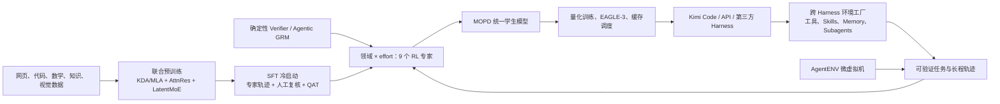

# Kimi K3 技术报告深度 Review

> 发布日：2026 年 7 月 27 日  
> 研究口径：以 K3 技术报告、官方模型卡、权重仓库、许可证及配套开源仓库为一手依据。技术报告中的训练、评测与成本结果均按团队披露处理；开源仓库“可访问”不等于性能已经被第三方复现。  
> 原始报告：[Kimi K3: Open Frontier Intelligence](https://github.com/MoonshotAI/Kimi-K3/blob/main/k3_tech_report.pdf)

## 核心结论

K3 最重要的信号是 Moonshot 已经把“前沿模型研发”改造成一套完整的 Agent 系统工程。2.8T 参数、1M context 和 benchmark 只是外显结果；模型结构负责扩大容量并压低长序列成本，后训练把领域和思考预算拆成九个专家策略，环境工厂持续制造跨 Harness 的长程任务，Verifier 与微虚拟机把真实执行结果转成训练信号，量化、缓存、调度和推测解码再把这套能力送入生产。

这条路线的独到之处是全栈耦合足够深，同时各层目标又相对清晰。KDA/Gated MLA 处理序列方向的信息流，AttnRes 处理深度方向的信息流，Stable LatentMoE 处理参数容量与激活成本，MOPD 处理多种 Agent 策略的合并，AgentENV 与 AET 处理长程任务的可验证性，MoonEP、KCP、QAT 和缓存调度处理训练及服务成本。它已经具备“Agent 能力生产系统”的形态，明显超出一套大模型配方。

六个关键判断：

1. **最有战略价值的资产是环境—轨迹—Verifier—训练—部署闭环。** 2.8T 权重是这套系统的一次产出；51,219,741 个训练/评测 sandbox、1,505,678 个镜像，以及覆盖 Kimi Code、Claude Code、Codex、OpenClaw、Hermes 的动态 Harness 组合，说明环境生产已经成为与预训练语料同量级的重要基础设施。
2. **K3 的架构创新具有系统一致性，但“约 2.5× scaling efficiency”仍是不可拆解的组合口径。** 报告没有公开纵轴数值、模型规模点位、重复实验、置信区间或逐模块消融，无法判断收益分别来自架构、优化器、数据还是训练策略。
3. **1M context 仍然需要上下文管理。** BrowseComp 在约 300K 处做 compaction 得到 91.2，直接使用完整 1M、关闭上下文管理反而是 90.4。K3 提高了长轨迹容量，但没有消除压缩、筛选、状态抽取和污染控制的价值。
4. **后训练的关键创新是把 reasoning effort 训练成条件化策略，再用九专家蒸馏合回统一模型。** low/high/max 超出了推理时 token 限额的范畴；它们分别经过领域化 RL、预算惩罚与统一蒸馏，属于模型行为分布的一部分。
5. **开放权重会扩大研究与生态影响，但不会自然带来去中心化部署。** Hugging Face 仓库约 1.56 TB、包含 96 个权重分片；许可证存在 MaaS、大规模产品归因等附加条件。准确说法是“开放权重、定制许可证”，不宜直接等同于 Apache/MIT 式开源。
6. **K3 已进入前沿 Agent 模型区间，但能力形状仍不均匀。** Coding、搜索、文档视觉和可验证数字任务较强；高难知识推理、GUI 操作、Agent 行为一致性、长程恢复与真实网络攻防仍有明显缺口。

## 一、战略定位：K3 重做的是 Agent 能力生产函数

### 1.1 技术含金量排序

| 优先级 | 机制 | 战略价值 | 证据强度 | 主要边界 |
|---|---|---|---|---|
| 1 | 跨 Harness 环境工厂 + AET + AgentENV | 把任务分布、执行反馈和可验证结果变成可持续扩张的后训练资产 | 报告披露完整机制与规模；配套仓库已开放 | 任务质量、模拟到真实迁移、Verifier 偏差尚无外部审计 |
| 2 | 领域 × effort 的九专家 RL + MOPD | 允许不同任务拥有不同策略与预算，再统一进一个可服务模型 | 算法与流程披露较完整 | 缺少相同底座、相同数据下的系统消融 |
| 3 | KDA/Gated MLA + AttnRes + Stable LatentMoE | 同时扩大序列长度、网络深度和条件容量 | 结构与关键数值细节充分 | 2.5× 总收益无法分项归因 |
| 4 | QAT、EAGLE-3、MoonEP、KCP、缓存感知调度 | 让超大 MoE 和 1M Agent 轨迹具备训练、推理和服务可行性 | 工程机制具体，部分代码开放 | 缺少第三方吞吐、延迟、集群成本复现 |
| 5 | 原生视觉与程序化多模态数据 | 将截图、网页、图表、CAD、视频纳入同一 Agent 轨迹 | 训练方案明确，公开评测较强 | 训练数据规模、比例、授权与污染审计未披露 |

这套排序与参数规模的宣传顺序不同。权重决定能力上限，环境和反馈系统决定能力如何持续增长，生产系统决定能力能否以合理成本被调用。对 K3 而言，后两者更难通过一次权重发布被复制。

### 1.2 一张系统图



这里有两个容易被混淆的边界：

- Harness 既是线上执行控制层，也是后训练轨迹的生成机制。K3 把 Harness 差异显式纳入训练分布，目标是降低模型对单一脚手架的依赖。
- 跨 Harness 训练不会让 Context Infra 消失。动态、私有、可审计的信息仍需要由运行时检索、注入、压缩和治理；模型只能学习如何使用这些信息，不能替代权限、来源和状态管理。

## 二、模型架构：同时改造序列、深度和专家三个维度

### 2.1 规格变化

| 指标 | Kimi K2 | Kimi K3 | 变化含义 |
|---|---:|---:|---|
| 总参数 | 1.04T | 2.78T | 条件容量显著扩大 |
| 每 token 激活参数 | 32.6B | 104.2B | 单 token 计算并未维持 K2 水平，能力上限与部署成本同步上升 |
| 网络层数 | 61 | 93 | 深度增加约 52%，需要新的深度信息通道 |
| 隐藏维度 | 7168 | 7168 | 扩容主要来自深度与 MoE，而非主干宽度 |
| 路由专家 | 384 | 896 | 接近千专家，负载均衡和通信成为一等问题 |
| 每 token 选择专家 | 8 | 16 | 路由稀疏度为 56:1 |
| 共享专家 | 1 | 2 | 保留全宽、稳定的公共计算路径 |
| 注意力 | MLA | 69 层 KDA + 24 层 MLA | 约 3:1 的线性递归与全局注意力混合 |
| 原生视觉 | 无 | 约 401M MoonViT-V2 | 文本、图像和视频从预训练开始共享主干 |

104.2B 激活参数是评估 K3 成本时不能忽略的数字。K3 不属于“只扩大总参数、基本不增加单 token 计算”的路线；它用更高 active compute 换取能力，再依靠极低精度、MoE 系统和缓存架构追回生产效率。

### 2.2 KDA + Gated MLA：固定状态与全局回读的分工

K3 的 93 层中有 69 层 KDA、24 层 MLA。每个主块采用 3 个 KDA 配 1 个 MLA，最后再保留一个全局 MLA 层。KDA 使用 delta-rule 递归状态，历史长度增加时无需为每个 token 持续保留完整 KV；MLA 负责重新读取全局内容，补偿固定状态压缩造成的信息损失。

这套混合结构有三个关键点：

- **位置与内容分工。** Gated MLA 不使用 RoPE，位置和近因信息主要由 KDA 提供，MLA 侧重全局内容检索。长上下文扩展不再依赖 RoPE 频率重调，但有效 1M 能力仍取决于长文档课程和任务数据。
- **数值稳定与硬件路径同时设计。** KDA 把 log-decay 下界设为 `g_min = -5`。16-token tile 的倒数项因此低于 `e^80`，可在 BF16 范围内稳定计算；原本难以放入 Tensor Core 的对角 tile 也能走高吞吐矩阵计算。这是典型的算法—数值—kernel 协同，不只是一个防溢出补丁。
- **精度没有被一刀切地下放。** MLA 输出保留 FP32，原因是 flash attention 的舍入偏差会在深网络中累积。K3 在最容易引发系统性误差的路径上主动保留精度，说明其低精度策略以误差位置为单位，而非按模块统一降精度。

KDA 的结构优势主要是长序列状态成本，代价则是有损压缩。K3 用周期性 MLA、真实长文档上采样、长程合成任务和 compaction 共同补偿；“固定状态”本身并不保证百万上下文中的任意细节都能被稳定找回。

### 2.3 AttnRes：把深度也变成可检索维度

传统残差连接把此前层输出逐次相加，网络越深，早期表示越容易被后续更新稀释。AttnRes 让当前层选择性读取 embedding 和此前 block 的表示。K3 将 93 层划成 8 个完整的 12 层块，末尾再加一个不完整块；当前层最多读取 9 个来源。

Block AttnRes 将存储和通信从逐层的 `O(Ld)` 降到按 block 的 `O(Nd)`。它与 KDA 解决的是两个不同问题：

- KDA/MLA 决定“沿 token 序列如何保存与读取历史”；
- AttnRes 决定“沿网络深度如何保存与读取中间表示”。

这使 K3 的核心结构可以理解为双轴检索：序列轴读取上下文，深度轴读取特征演化。对 93 层、原生多模态和长程 Agent 轨迹而言，这种分工比单纯加深网络更有解释力。

### 2.4 Stable LatentMoE：高稀疏度下的三项修复

K3 每个 token 从 896 个路由专家中选择 16 个，并叠加 2 个全宽共享专家。路由专家的 latent width 为 3584，只有主隐藏维度 7168 的一半；共享路径维持全宽。目标是让公共能力走稳定通道，让条件容量走高稀疏通道。

接近千专家带来两个直接风险：连续近四次矩阵乘法可能放大激活，少数专家的负载偏斜会放大通信与训练不稳定。K3 对应引入三项机制：

1. **上投影前 RMSNorm。** 控制进入连续矩阵乘法链路的输入尺度。
2. **SiTU-GLU。** 对 gate 和 up projection 使用平滑饱和函数，参数分别为 `β₁=4`、`β₂=25`，将坐标输出的无穷范数限制在 100 以内。它保留大部分线性区，同时对极端激活软封顶。
3. **Quantile Balancing（QB）。** 每个专家维护一个仅影响 dispatch 的 bias，不修改 mixture weight，也不进入梯度；目标负载用全局 margin 直方图近似求分位数。报告采用 1000 个 bin，量化误差为千分之几，通信量低于传输全部 margin 的 1%，推理时冻结 bias。

QB 是一个容易被低估的工程算法创新。它把“均衡专家负载”从连续优化问题改成可控的全局分位数估计，既避免 auxiliary loss 干扰主目标，又把跨卡通信压到可接受范围。它的真实价值要看极端路由分布、不同 batch 和异构集群下是否仍稳定，报告尚未给出这些压力测试。

### 2.5 Per-Head Muon：优化器也服从注意力结构

Muon 会对动量矩阵做正交化。K3 没有把 Q/K/V 当作一个完整大矩阵处理，而是按 attention head 分别正交化，使每个 head 的更新尺度更一致，并略微减少计算。这个变化不醒目，却反映出一条清晰原则：当模型结构已经分解为多个语义独立的 head，优化器也不应继续假设它们属于同一个统计对象。

报告没有给出 Per-Head Muon 的单独增益、收敛曲线或对照方差，因此它目前属于“机制合理、归因未完成”。

### 2.6 原生视觉：从头训练，而非后接视觉塔

MoonViT-V2 约 401M 参数、27 层，从随机初始化开始，仅依赖 next-token prediction 与主模型联合训练，没有使用 SigLIP 初始化。报告称，从头训练的版本梯度范数更低、spike 更少，并在所列视觉评测上追平 SigLIP 初始化基线；但正文没有给出该对照的逐项数字。

视觉数据同时包含 caption、图文交错、OCR、感知、视频和 visual coding。2×2 pixel shuffle 将视觉 token 数降到四分之一，最高支持 3584×3584 输入。其更高价值在于让代码、渲染结果、网页、SVG、3D、游戏和 CAD 出现在同一条自回归轨迹中，为后续的 GUI、webdev 和数字内容 Agent 提供统一表征。

### 2.7 对“2.5× scaling efficiency”的审计

技术报告把 KDA、AttnRes、Stable LatentMoE、Per-Head Muon、训练数据和 recipe 的合并收益概括为约 2.5× overall scaling efficiency。这个数字适合说明团队内部观察到一条更好的 scaling 曲线，不适合被转述为“某个模块让训练效率提高 2.5 倍”。

缺失的信息包括：

- scaling-law 实验使用了哪些模型规模、token 数与算力点；
- 图中纵轴的具体 loss 数值与数据点；
- 每个结构和数据变化的单独消融、交互项与重复实验；
- 2.5× 指等 loss 所需 FLOPs、等 FLOPs 的 loss 改善，还是内部综合指标；
- 预训练算力、GPU 型号、总训练 FLOPs 与 wall-clock。

更稳妥的结论是：**K3 提出了一套内部验证有效的联合 scaling recipe；2.5× 是团队披露的组合收益，当前不能独立复现，也不能分项归因。**

## 三、预训练与数据：从“语料集合”转向“可执行世界”

### 3.1 已披露的数据结构

| 数据层 | 报告披露 | 对能力的作用 | 仍缺少的口径 |
|---|---|---|---|
| Web Text | 规则、质量分类器、去重、领域采样 | 通用语言与世界知识 | token 数、语言比例、时间截点、来源许可 |
| Code | 独立领域采样，覆盖 visual coding | 程序生成、软件工程与可执行验证 | 仓库范围、许可证、去污染规则 |
| Mathematics | 风格/视角改写、分块自回归生成、事实一致性验证 | 增加推理表达与题型覆盖 | 合成占比、教师模型、难度分布 |
| Knowledge | 重写与 fidelity verification | 补充稀疏知识、改变表达方式 | 原始来源、知识时效、重复率 |
| Vision | caption、图文交错、OCR、感知、视频 | 原生多模态与文档理解 | 总图像/视频量、授权、人物与敏感数据治理 |
| Programmatic multimodal | 代码 + SVG、3D、网页、游戏、CAD 渲染 | 让视觉结果与可执行程序对齐 | 生成器覆盖、真实性、分布偏差 |
| Long-context | 清洗长文档/视频、真实长文档上采样、拼接和重排合成 | 1M 检索、跨段推理、长轨迹状态保持 | 长样本比例、长度分布、污染和重合审计 |

K3 的数据策略有两个鲜明变化。

第一，**多模态数据越来越像程序执行记录，而不是静态图文配对。** 代码与渲染产物天然构成可验证映射，适合训练网页、图形、CAD 和界面 Agent。其潜在上限高于纯 caption 数据，风险是程序生成器的审美、布局和工具分布会被模型继承。

第二，**长上下文训练强调信息分散方式，而不只强调样本长度。** 团队会上采样真实长文档，也会把多篇文档和多模态片段重排、拼接，再设计需要跨位置收集信息的子任务。长度只是容器，信息跨度、干扰项和依赖结构才决定是否真正训练出长程能力。

### 3.2 训练课程

基础预训练从 8K context 开始，后期扩展到 64K；cooldown 阶段再依次扩展到 256K 和 1M。只有少量高成本长序列进入训练。该设计符合算力经济性：绝大多数 token 不需要承担百万序列的 attention、通信和状态成本，长程能力集中在后段课程中塑形。

团队分别搜索 cosine 与 WSD 的最优超参数后，报告称 cosine 获得更低最终 loss；学习率含 1% warmup，weight decay 为 0.1。这里同样缺少绝对 loss、超参数网格和重复实验，不能把结果推广成“cosine 普遍优于 WSD”。

### 3.3 数据透明度是报告最大的缺口

K3 没有披露：

- 预训练总 token 数及文本、代码、数学、知识、图像、视频的占比；
- 主要语种和地区分布；
- 数据时间截点与更新机制；
- 版权、许可证、个人信息和敏感数据治理口径；
- 公开 benchmark、内部 benchmark 与训练数据的去污染方法及结果；
- 合成数据使用的教师模型、合成占比和拒绝率；
- 训练集与 K2/K2.5 数据的继承关系；
- 总训练算力、集群规模、硬件代际、总 FLOPs、成本与能耗。

这些缺口不会否定模型结果，但会限制三类判断：外部团队无法复现 scaling 结论，企业无法完整评估数据合规风险，研究者无法区分架构收益与数据升级收益。对一份以“开放前沿智能”为主题的技术报告而言，权重开放程度高于训练可解释性。

## 四、后训练：九个策略专家如何合成一个 K3

### 4.1 三阶段结构

| 阶段 | 核心做法 | 战略含义 |
|---|---|---|
| SFT 冷启动 | 汇集多个 Kimi 专项模型轨迹，多阶段验证与人工复核；从此阶段开始 QAT | 把已有模型和人工经验变成统一策略起点，同时提前适应生产量化 |
| 专项 RL | 3 个领域 × 3 个 effort，形成 9 个专家策略 | 允许不同任务、预算和工具链拥有不同最优行为 |
| MOPD | Multi-Teacher On-Policy Distillation，将九专家合回统一学生 | 以一次服务入口覆盖多种策略，避免线上维护九套完整模型 |

三个 RL 领域分别是：

1. 通用能力：经验、视觉、推理、faithfulness、搜索、知识工作；
2. 通用 Agent：长程助手、Deep Research、段落写作；
3. Coding Agent：SWE、编程经验、kernel、web development。

每个领域再训练 low、high、max 三种 effort。K3 将相互冲突的任务和预算目标拆开，通过专家化优化分别寻找策略，随后再合并。

### 4.2 Effort 是行为策略，不是简单限额

每类问题先测得冷启动预算 `b₀`。若训练中的总输出 token 超过 `τ × b₀`，任务 reward 直接记为 -1；Agent 任务的计数包括 reasoning、工具参数和多轮输出。团队先训练 max，再逐步降低 `τ` 得到 high 和 low，且阈值按领域设置、由人工经验校准。

这意味着 effort 会同时影响：

- 是否调用工具以及调用多少次；
- 搜索、验证和回退的深度；
- 思考与最终输出的长度分配；
- 在不确定性下继续探索还是尽早提交；
- 失败后是否重试、换策略或接受较低置信度。

因此，effort 的评估单位应是“在给定预算下的任务成功率、成本、延迟和失败风险”，不能只比较 benchmark 分数，也不能把 max 当成单调更强的能力档位。

### 4.3 Partial rollout：让超长轨迹不再阻塞训练

每轮从 `N` 个 prompt 各采样 `K` 条完成。当其中 `λ` 比例结束后，系统即开始更新；未完成的长轨迹暂停，后续迭代继续。这样可以减少少量超长 Agent 任务对整批训练的拖累。

代价是部分轨迹恢复时已经由旧策略生成，形成 off-policy 数据。报告称 per-token regularization 可以容忍极端 off-policy，但具体算法主要沿用 K2.5，K3 报告没有给出策略陈旧度分布、稳定性曲线或与同步 rollout 的对照。它首先是吞吐优化，其次才是已经被充分证明的 RL 算法结论。

### 4.4 Agentic GRM：先定义任务自己的评分标准

对缺少确定性 verifier 的任务，K3 使用 tournament 式二元比较。Judge 依次读取输出、生成针对该任务的 rubric、评分并记录 scorepad；若答案长度超过基线长度 `l₀` 的 `σ` 倍，直接判负。

这项设计同时压制两个常见 reward hack：

- 用冗长回答换取“更全面”的表面优势；
- 让通用 judge 在没有任务标准的情况下凭整体印象打分。

风险也很明确：rubric 由 Judge 即时生成，其偏好可能与生成模型同源；长度基线会惩罚确有必要的长答案；tournament 只提供相对胜负，不天然保证绝对正确。高价值专业任务仍需要确定性检查、领域专家抽检和外部结果验证。

### 4.5 MOPD：蒸馏的是策略分布

Multi-Teacher On-Policy Distillation 让统一学生模型在自己的 rollout 上学习九个专家，通过逐 token、裁剪后的 log-probability ratio 构造奖励。团队尝试过 top-k distillation，但没有观察到优势。

这比离线模仿专家答案更接近策略迁移：学生在自己的状态分布上暴露错误，教师信号再校正每一步 token 概率。它能降低 train–serve 分布偏移，也避免永久运行九个专家模型。需要补充的关键实验证据是：统一学生相对九专家分别损失多少能力，不同 effort 是否会互相污染，以及切换 effort 时是否保持可校准性。

## 五、Agent 数据与环境：K3 最可能形成长期壁垒的部分

### 5.1 白盒环境把 Harness 本身纳入训练分布

K3 的统一 RL 环境把 Agent Harness 拆成可组合模块：工具、system prompt、context management、Skills、Memory、subagents 等。训练时可以动态构造 Kimi Code、Claude Code、Codex、OpenClaw、Hermes 及新的变体，并为不同任务配置不同工具和上下文策略。

这不是普通的数据增强。它在训练中主动改变“模型所处的执行系统”，让模型学习在多种协议、工具集合和上下文管理方式下完成任务。战略价值有三层：

1. 降低模型对 Kimi Code 单一脚手架的过拟合，扩大第三方生态的可用性；
2. 把 Harness 变化从线上兼容问题，前移为后训练分布设计问题；
3. 让新的 Harness 机制可以先在环境工厂中制造轨迹，再进入模型能力。

其边界同样重要。报告列出覆盖的 Harness 名称，却没有公开各 Harness 的采样比例、配置空间、效果矩阵或留出 Harness 测试。现阶段可以确认“跨 Harness 是训练目标”，不能确认 K3 已经实现 Harness 无关。

### 5.2 自演化知识图谱是课程控制面

Agent 通过网页探索构建层级知识图谱，将概念组织为去重、原子化的有向无环图；系统从节点及其祖先采样主题，检索公共材料，再生成 coding、knowledge、vision 等任务。

更准确的理解是“后训练课程控制面”，而非单纯的知识库：

- 图谱控制任务覆盖哪些概念与层级；
- 祖先关系控制任务需要多少背景依赖；
- 节点密度暴露训练分布的空白；
- 新资料可以快速转化为任务，而无需等待下一轮静态数据集；
- 生成结果又能反向扩充图谱和难度分布。

潜在风险是自我强化：若探索 Agent、任务生成器和 Judge 共享相似模型偏好，图谱会持续放大同一类表达、工具和解题路径。去重能减少重复，不能自动保证观点多样性、事实覆盖和难度真实性。

### 5.3 AET：不提供标准轨迹，只验证最终状态

Agentic Environment Training（AET）为任务提供初始状态、目标、工具、预算和独立 verifier，不提供参考轨迹。模型可以自行搜索、试错和调用工具，只要最终状态满足 verifier。

这项设计非常适合真实数字工作：同一软件修复、表格分析或研究任务通常存在多条有效路径，强行模仿一条标准轨迹会限制探索。AET 将优化目标从“像专家步骤”转向“在预算内交付可验证结果”。

它也把 Verifier 的设计质量推到核心位置：

- 公开与隐藏检查共同降低针对测试用例的投机；
- 限制提交次数，抑制用 verifier 反复探测答案；
- Agent 与 verifier 隔离，避免读取评分逻辑；
- 奖励最终状态，弱化无效的中间表演。

所有 verifier 都定义了一个可被优化的代理目标。越是开放式、专业化的任务，越需要检查 verifier 是否漏掉事实正确性、来源质量、权限边界和副作用。

### 5.4 Kernel、企业应用与 Webdev 环境

| 环境 | 任务与奖励 | 高价值信号 | 主要风险 |
|---|---|---|---|
| Kernel | CUDA、Triton、CuTe、Gluon、ThunderKittens、TileLang；先过正确性阈值，再按专家实现或 roofline 计性能 | 直接优化可执行代码和硬件效率 | 容易利用图重放、输入缓存、降精度等漏洞，hacking detector 需要持续更新 |
| 企业应用 | 自建 Gmail、Notion、Slack、Canvas 等模拟系统；可跨多日、数千次工具调用、百万累计 context | 避免真实 API、凭证、限流和不可复现状态，适合长程流程训练 | 模拟语义与真实产品权限、异常和脏数据之间存在 sim-to-real gap |
| Webdev | 代码、构建、交互、像素与结构检查，叠加模型 Judge；伪造产物或构建失败为零分 | 将前端视觉质量与真实运行状态结合 | 视觉 Judge 和模板生成器可能形成风格偏置 |
| Search / Knowledge Work | 搜索、投行、数据、法律、视觉推理，结合确定性或模型评分 | 将专业任务转成可执行、可复核训练单元 | 专业正确性和时效性很难完全由自动评分覆盖 |

企业应用模拟器尤其关键。报告描述的任务可跨越多个模拟日和事件，并产生数千次工具调用、百万级累计上下文。它训练的不只是 API 调用，而是状态迁移、延迟事件、跨应用协调和长期计划。真实世界中的权限变化、网络抖动、数据缺失、人工插入和合规限制仍需单独验证。

### 5.5 51,219,741 个 sandbox 代表什么

AgentENV 基于 Firecracker microVM，checkpoint 与 resume 分别约 133 ms、49 ms；暂停后不占用 CPU 和内存，fork 可让 reward judging 在不影响原执行状态的副本中运行。报告称模型推理可占 sandbox 生命周期的 98%，内存 overcommit 达 6.5×。K3 训练与评测累计创建 51,219,741 个 sandbox，覆盖 1,505,678 个镜像。

这组数字说明 Moonshot 已经把 Agent 运行环境工业化：

- 可暂停使 partial rollout 真正可行；
- 可 fork 让多个 Judge 和隐藏测试并行、无副作用运行；
- 可快照让失败轨迹复现、恢复和比较；
- 高密度隔离把大量长尾软件依赖转成可调度资源；
- 大规模镜像集合扩大任务和工具分布。

[AgentENV 仓库](https://github.com/kvcache-ai/AgentENV) 已公开，证明实现入口存在；51M 规模、6.5× overcommit 与 98% 时间占比仍是团队报告数据，尚无第三方集群复现。

## 六、训练与推理工程：2.8T 能否被使用，取决于这些“配角”

### 6.1 MoonEP：接近千专家时，通信布局就是模型的一部分

MoonEP 为每个 microbatch、每一层动态选择冗余专家，使每个 rank 接收恰好 `S × K` 个 token，并提前预取下一层规划。理论上每个 rank 最多需要 `E/R` 个冗余专家。固定大小 buffer 只需覆盖 `S × K`，而按最坏路由预留的方案可能达到 `S × K × R`。

固定 shape 带来三项收益：

- 消除逐层 host 同步和动态内存分配；
- 专家 GEMM 可以按实际 workload 调度；
- 通信与计算更容易流水重叠。

MoonEP 用冗余参数换取确定的 token 布局，作用超出常规 All-to-All 通信。当专家数量接近 1000、路由分布随层和 batch 波动时，静态计算形状会直接影响训练可用性。[MoonEP 仓库](https://github.com/MoonshotAI/MoonEP) 已以 MIT 许可证开放，但当前代码规模仍小，报告中的大集群效率需进一步复现。

### 6.2 FlashKDA 与 KCP：固定状态不等于无需通信

KDA 避免随序列增长的完整 KV cache，却仍需计算 chunk 内部和跨 chunk 的递归状态。FlashKDA 以 CUTLASS kernel 重叠 chunk 内计算与状态递推；单机 context parallelism 对序列分片，跨设备 KCP 再将本地 transition 与生成状态通过结合律 prefix scan 和 all-gather 合成。

这个细节修正了一个常见误解：线性递归注意力把通信对象从“全部历史 KV”变成“固定大小状态”，没有把分布式依赖消除。K3 的长上下文优势来自状态大小、kernel 和 collective 共同变化。

### 6.3 内存管理被抽象为存储策略

训练系统把 recompute、量化、CPU offload、远端 offload 视为不同的 tensor storage policy，而不是散落在各模块的特例。具体包括：

- FP8 activation 与 offload；
- MoE 和 AttnRes 的内存优化；
- 借助 Mooncake 在 pipeline rank 间远端 offload；
- CPU 保存 gradient shard；
- Per-Head Muon 参数使用点对点 gather，避免完整 all-gather；
- 动态视觉输入采用 context parallelism，并把 ViT 前后向放入 pipeline bubble，尽量隐藏视觉编码成本。

这种抽象的长期价值高于单次显存节省。新硬件、网络或量化格式出现后，团队可以替换 tensor policy，而不必重写模型逻辑。

### 6.4 1M RL：几百张 GPU 背后的状态调度

报告称 1M context RL 在数百张 GPU 内完成，关键是训练与 rollout 共置、partial rollout 和多层 offload：

- GPU 只保留活跃 KV/KDA 状态，淘汰状态写回外部 CPU DRAM 池；
- KDA checkpoint 与 MLA block 对齐，便于恢复；
- 在训练与 rollout 切换时，将模型和优化器状态卸载到 NVMe，释放 DRAM；
- 根据请求量、队列和 KV 使用自动节流；
- FP32 gradient buffer 可复用为 reference model 的流式空间。

这套方案的本质是把“长轨迹 RL”改造成状态生命周期管理问题。算法允许轨迹暂停，sandbox 保存环境状态，KV/KDA 池保存模型状态，NVMe 保存训练状态，调度器决定哪类状态何时回到计算层。

### 6.5 QAT 从 SFT 开始，而非部署前补救

K3 从 SFT 起即使用量化感知训练：路由专家权重为 MXFP4，专家 activation 为 MXFP8；attention、latent projection、共享专家和 router 保持更高精度。训练与 rollout 使用同一量化方案。

这是一个高价值细节。后训练会改变激活分布和工具策略，如果最后才做 PTQ，量化误差可能集中出现在最重要的 Agent 行为上。K3 让策略从冷启动阶段就在目标数值格式中学习，减少 train–serve mismatch。它并未把所有模块降到 FP4，说明团队把误差敏感度和部署收益逐路径权衡。

### 6.6 EAGLE-3：目标是接受率，不是语言建模损失

K3 以 MTP 层初始化 EAGLE-3 draft model，冻结目标模型，融合第 1、4 和最后一个 AttnRes block 的特征，进行 7 步 unroll。训练直接优化与 speculative acceptance 对齐的 `L_K`，不再叠加 ground-truth cross-entropy。

这表明推测解码的 draft 不被当成“小号 K3”，而是一个专门提高目标模型接受率的提议器。早、中、晚层特征分别携带浅层模式、中程结构和最终语义，直接服务验证概率。报告没有给出端到端接受率、不同请求长度下的 TPOT 提升和额外显存开销，生产收益仍需实测。

### 6.7 推理缓存：把物理存储与逻辑复用解耦

K3 将 KDA 状态与 MLA KV 放入统一 paged pool，同时分离两种粒度：

- 物理 cache block 为 1024–6144 tokens，用于显存和搬运效率；
- hash block 固定为 512 tokens，用于前缀匹配和复用。

KDA 只在 hash endpoint 或 turn boundary 保存稀疏 checkpoint。speculative decoding 回滚时不复制整个 recurrent state，而是缓存投影后的输入，在芯片上重放恢复状态。服务集群再按 cache locality 分为主、次级节点；故障迁移时允许 reprefill，并用预算 admission control 隔离超长请求。

典型 coding 请求被描述为约 400K 前缀加 4K 增量。对于这种工作负载，是否命中历史前缀，往往比单 token 峰值速度更影响单位任务成本。K3 的服务优化明确围绕长会话增量更新定制，目标有别于通用吞吐最大化。

## 七、XTML：消息协议已经参与模型能力与缓存经济性

K3 使用 XTML chat template，以显式 open、separator、close 和 end-of-message token 表达消息、channel 与工具调用。全局选项——例如工具声明和 reasoning effort——放在历史之前；一次性的 `tool_choice`、`response_format` 放在历史之后。这样变更一次性选项时，不必让整段历史前缀 cache 失效。

这是一项容易被大多数解读忽略的系统设计：

- chat template 不只是序列化格式，也决定 KV cache 的失效范围；
- 动态工具可在会话中追加，而无需重写全部历史工具声明；
- think、response 和 tools channel 分离，有利于并行工具调用和 typed arguments；
- 推理控制项的位置安排直接影响缓存命中和长会话成本。

模型卡要求回传此前 assistant message 的完整 `reasoning_content` 与 `tool_calls`。这会带来四个生产问题：

1. 历史 reasoning 成为事实上的状态协议，第三方 Harness 若丢失或重排会影响表现；
2. 中途切换模型时，其他模型未必理解或接受该状态；
3. reasoning 可能包含敏感信息、错误假设或过期计划，需要单独的保存与审计策略；
4. 会话越长，context pollution 与缓存依赖越强，不能只依赖模型自行清理。

因此，K3 的 1M context 提高了 Agent 轨迹的可容纳上限，也增加了状态迁移、隐私、可删除性和跨模型兼容成本。Context Infra 的职责从“把资料塞进 prompt”扩展为消息协议、状态分层、压缩、权限与缓存治理。

## 八、评测 Review：强项集中在有环境反馈的数字任务

### 8.1 公开 benchmark 所呈现的能力形状

| 任务 | K3 | 报告中的最强对比 | 差值 | 解读 |
|---|---:|---:|---:|---|
| DeepSWE | 67.5 | GPT-5.6 Sol 73.0 | -5.5 | 高难真实软件工程仍未领先 |
| ProgramBench | 77.8 | K3 77.8 | 领先 | 复杂编程处于头部 |
| TerminalBench 2.0 | 88.3 | K3 88.3 | 领先 | 工具化终端任务突出，但采用多 Harness 取最佳结果 |
| FrontierSWE | 81.2 | K3 81.2 | 领先 | 可验证软件任务强 |
| SWE-Marathon | 42.0 | K3 42.0 | 领先 | 超长软件工程具有优势 |
| BrowseComp | 91.2 | K3 91.2 | 领先 0.8 | 搜索与长轨迹整合强，compaction 参与结果 |
| GDPval-AA | 1686 | Claude Fable 5 1747 | -61 | 专业知识工作接近头部，仍有差距 |
| OSWorld 2.0 | 58.3 | Claude Fable 5 66.1 | -7.8 | GUI/电脑操作是明显短板 |
| OfficeQA | 63.3 | Claude Fable 5 69.9 | -6.6 | 文档理解强，但办公场景尚未领先 |
| HLE | 43.5 | Claude Fable 5 53.3 | -9.8 | 高难知识与推理上限有差距 |

K3 的强项普遍具备三种特征：环境可执行、结果可验证、允许工具反馈。弱项则更多涉及模糊目标、GUI 交互、行为一致性和高难开放知识。这与其后训练资产的分布高度一致。

内部评测进一步暴露边界：

- Swarm 76.3、DeepResearch 90.0，显示多 Agent 协作和研究任务较强；
- Agent Behavior 65.0，低于 Fable 5 的 75.5 和 GPT-5.6 Sol 的 76.4；
- MIRA 64.1，低于 Fable 5 的 72.9；
- Claw 48.3，低于 GPT-5.6 Sol 的 52.0；
- Agentic Vision 78.3，低于 GPT-5.6 Sol 的 82.9；
- Online 77.9，低于 GPT-5.6 Sol 的 84.0。

能力上限已经很高，稳定行为、真实在线适应和长程交互仍是主要差距。对生产 Agent 而言，后者往往比单次难题得分更决定可托付程度。

### 8.2 最关键的 1M 评测细节

BrowseComp 使用约 300K context 时做 compaction，得分 91.2；团队另测完整 1M、关闭上下文管理，得分 90.4。两者只差 0.8，未披露统计区间，不能据此断言 compaction 普遍更强；但足以否定“窗口越大、保留越多就一定更好”。

更合理的解释是：

- 原始轨迹包含重复网页、无效搜索和早期错误；
- compaction 提高信息密度，减少注意力竞争；
- 1M 容量提供不丢失关键证据的余量，管理策略决定哪些证据继续在线；
- context window、有效记忆和任务成功率是三个不同指标。

K3 让长上下文管理从“因窗口不够而被迫压缩”，升级为“在充足容量内主动优化信息密度”。

### 8.3 横向比较的六项口径问题

1. K3 统一使用 max effort，单步任务 temperature 1、top-p 0.95，Agent 任务 temperature 1；不同厂商的 effort 和采样并非等价。
2. Coding 评测分别运行在 Kimi Code、Claude Code、Codex 等 Harness；TerminalBench 对所有模型报告跨 Harness 最佳分，测到的是模型—Harness 组合上限。
3. 部分 baseline 使用 fallback 或受到 cyber guard 影响；SWE-Marathon 还使用 K3 的 pre-final v1.1 分支。
4. PostTrainBench 存在 H20 与官方 H100 口径差异，硬件及 kernel 环境会改变结果。
5. 多项内部 benchmark 持续刷新，样本量、题目公开程度、置信区间和污染审计不足。
6. 部分竞品成绩取自第三方或重新计算，不能视为完全统一的原始运行。

因此，表 2/3 适合判断能力分布和候选模型，不足以支持“同一成本、同一 Harness 下全面领先”的结论。

### 8.4 成本曲线测到的是系统，不是纯模型

报告称：

- BrowseComp 约 2.03 美元/任务，约为 GPT 的一半、比 Claude 低一个数量级；
- Kimi Code Bench 相对 Fable 5 少约 4 分，但任务成本约为其 38%；
- GDPval-AA 相对 GPT 便宜约 13%，相对 Fable 5 便宜约 2.6 倍。

这些结果有决策价值，但口径是混合的：Kimi 成本由内部运行测得，竞品多按公开 token 价格计算；不同模型使用的 Harness、cache、token 长度、fallback 和成功率不同。它回答的是“以当时价格和指定系统完成该 benchmark 大约花多少”，不是模型算法的纯效率排名。

真正应跟踪的指标是：

`单位成功任务成本 =（模型 token + 缓存读写 + 工具与 sandbox + 重试 + 人工复核）/ 通过独立 verifier 的任务数`

对长程 Agent，还应同时报告 P50/P95 完成时间、失败后恢复率、无效工具调用占比和上下文增长速度。

### 8.5 Cyber：结果有进展，也暴露真实上限

报告中，Tier 1 漏洞发现经人工复核约 70% 被确认，6 个项目中发现 16 个此前未知问题。这里缺少候选总数、项目选择方式和严重性分布，不能把 70% 当成无条件 precision。

Tier 2 任务完成 14/36，高于 GLM 的 8/36，其中 10 个是 user-space；主要失败集中在最终 exploit chain、策略调整、调试循环和最终验证。UK AISI/NIST 评测中，ExploitBench 完成 32 项、步骤深度 17，但任意代码执行为 0/41。这个零分比单项领先更有战略信息：K3 能发现和推进局部技术问题，尚未稳定完成最高难度的端到端攻防闭环。

### 8.6 官方案例不等于生产复现

24 小时 kernel 优化、MiniTriton、48 小时 nano-KPU、42 年 ASIC 文献研究和 GWTC 多 subagent 分析展示了能力上限，但共同属于团队选取的案例。配套仓库可以检查产物存在性，不能自动验证所有过程和性能结论。

- [MiniTriton](https://github.com/MoonshotAI/minitriton) 自述为 “teaching-grade but production-minded”，仍列有已知缺口；
- [nano-kpu](https://github.com/MoonshotAI/nano-kpu) 明确说明是展示性项目、并非 Moonshot 官方芯片项目，时序与面积为 pre-layout 估算，不是 sign-off；
- 单个成功案例无法给出成功率、选择偏差、失败分布和复现成本。

这些案例适合说明 K3 能在长时间、高工具密度任务中形成复杂产物，不适合直接推导“可以独立交付生产编译器、芯片或投研成果”。

## 九、十二个容易被忽略、但更有决策价值的细节

### 1. 跨 Harness 已经从兼容性问题变成训练目标

K3 不只在不同 Harness 上测分，而是在训练环境中动态组合 Kimi Code、Claude Code、Codex、OpenClaw 和 Hermes。未来模型差异可能部分来自“见过多少执行系统分布”，而不只是见过多少任务。

### 2. Context management 在 1M 模型上仍创造正收益

BrowseComp 的 300K compaction 结果略高于不管理的完整 1M。长窗口扩大了管理空间，没有替代管理本身。

### 3. Reasoning history 是隐性的 API 状态

历史 reasoning 必须回传，意味着会话可迁移性、模型切换、隐私删除和 cache key 都受模型训练协议约束。它可能提高连贯性，也形成新的 runtime lock-in。

### 4. 一次性控制项的位置是缓存经济学设计

`tool_choice` 和 `response_format` 被放在历史之后，可以避免一次参数变化让数十万 token 前缀失效。这项协议设计会直接影响毛利率。

### 5. KDA 的 BF16 衰减下界同时改变了可用 kernel

`g_min=-5` 既避免数值溢出，也让对角 tile 能走 Tensor Core。很多“算法稳定性”改动的真实价值来自它解锁了更好的硬件路径。

### 6. MLA 输出保留 FP32，暴露了低精度的真实边界

团队观察到 flash attention biased rounding 后没有继续追求全链路低精度。K3 的效率来自选择性降精度，而不是宣传口径上的 FP4 覆盖率。

### 7. QAT 从 SFT 开始，策略本身适应部署格式

量化不是模型完成后的压缩步骤。专家策略、工具使用和长程行为在 MXFP4/MXFP8 环境中形成，减少了部署后的能力漂移。

### 8. MOPD 蒸馏的是学生自己的轨迹

On-policy distillation 让教师纠正学生实际会进入的状态，而不是只复制理想答案。其价值更接近多策略合并，远高于普通“用强模型生成 SFT 数据”。

### 9. AgentENV 的 fork 能让评分无副作用

Reward judging 可在执行状态的副本上运行。对会修改文件、数据库或应用状态的 Agent，这是扩大 verifier 并行度和保持结果一致性的基础能力。

### 10. 模拟 SaaS 解决了凭证与复现，却引入新的迁移鸿沟

自建 Gmail、Notion、Slack 等环境让百万级工具轨迹可规模化生成；真实产品中的权限、组织规则、脏状态、延迟和人为干预仍可能成为主要失败源。

### 11. 公开权重与可部署性之间存在 1.56 TB 的距离

96 个权重分片让研究访问成为现实，却把高效全量服务限制在超大显存、快速互连和成熟 MoE runtime 的机构。生态影响会扩大，生产推理仍高度集中。

### 12. 安全评测的 0/41 比榜单排名更能定位能力边界

K3 可以发现漏洞、推进多步 exploit，也能在部分任务领先；任意代码执行 0/41 说明真实闭环仍会在策略切换、调试和最终验证处断裂。这与 Agent Behavior 等评测的差距相互印证。

## 十、开放权重的真实边界

[Hugging Face 模型仓库](https://huggingface.co/moonshotai/Kimi-K3/tree/main) 已提供约 1.56 TB 权重、96 个 safetensor 分片和模型配置；[模型卡](https://huggingface.co/moonshotai/Kimi-K3) 披露了架构、使用方式与部分评测配置。

[Kimi K3 License](https://huggingface.co/moonshotai/Kimi-K3/blob/main/LICENSE) 授予较广泛的使用、修改和分发权，同时包含商业条件：商业 MaaS 提供方及关联方任意连续 12 个月总收入超过 2000 万美元时，商业用途需另行取得许可；产品或服务月活超过 1 亿，或月收入超过 2000 万美元时，需在用户界面显著展示 “Kimi K3”。内部使用等情形另有豁免。具体适用性应由法务按业务主体、产品规模和服务方式判断。

因此：

- “权重已经完整发布”是可核验事实；
- “任何主体均可无条件商用”不是准确表述；
- “权重开放后即可低成本私有化”忽略了 2.78T 模型、104.2B active compute、互连与 runtime 门槛；
- “开源会削弱 Kimi API 优势”也过于简单。Moonshot 自有的环境工厂、服务缓存、量化训练和超大集群经验不会随权重一并复制。

## 十一、对模型、Harness 与 Context Infra 的战略含义

### 11.1 对模型团队

前沿 Agent 模型的投入结构正在改变。预训练仍决定通用能力上限，新增边际投入更集中于：

- 可规模化生成、隔离和恢复的执行环境；
- 针对真实结果的 verifier 与 anti-hacking；
- 领域、预算和 Harness 条件化的后训练；
- 量化格式、通信拓扑和推理缓存的联合设计；
- 将线上失败回流为任务、环境与评分规则。

如果只能复制 K3 的注意力或 MoE 模块，而无法复制任务环境与反馈闭环，能力差距很难持续收敛。

### 11.2 对 Harness 团队

Harness 的角色从“给模型装工具”进一步变成两类基础设施：

1. 线上控制：权限、工具、消息、状态、重试、预算和结果验证；
2. 训练数据生成：定义模型会遇到的工具分布、上下文策略和失败路径。

模型会越来越熟悉主流 Harness 约定，但生产差异仍来自环境质量。最重要的产品指标不再是“是否支持 K3”，而是同一模型在不同 Harness 下的成功率、恢复率、成本和轨迹可审计性。

### 11.3 对 Context Infra

K3 同时强化了 Context Infra 的三个方向：

- **长轨迹管理。** 1M 提供容量，compaction、分层状态、去重和错误隔离提高有效密度。
- **跨模型状态协议。** preserved reasoning 提升单模型连续性，也增加切模、迁移和删除难度。
- **训练—线上一致性。** Skills、Memory、subagents 和 context management 已进入 RL 环境，线上 Context 设计会反向成为下一轮模型行为先验。

可长期复用的 Context 仍应保存在外部：组织私有知识、实时状态、权限、来源、审计记录和可撤回信息不适合固化进模型。模型更擅长使用 Context，不等于它拥有正确、最新、合规的 Context。

### 11.4 对 MaaS 与开放模型生态

K3 的开放权重会带来三种市场效应：

- 研究机构和云平台可以检查、量化、微调并建设兼容 runtime；
- 第三方 Harness 获得一个跨 Harness 训练、原生 1M 与视觉的前沿底座；
- 超大权重、定制许可证和专用工程栈继续把高性能生产部署集中在少数平台。

竞争焦点会从“是否有权重”转向“谁能以更低单位成功任务成本运行它、谁拥有更好的环境与反馈数据、谁能让客户状态安全地跨会话和跨模型流动”。

## 十二、采用建议：优先试点，不宜只凭榜单替换默认模型

### 12.1 适合优先验证的任务

- 需要代码、终端、搜索和视觉共同参与的长程任务；
- 大型仓库修改、网页与数字内容生成、文档和图表处理；
- 有明确 verifier、测试、构建或产物检查的任务；
- 会产生超长可复用前缀、且缓存命中率可控的持续会话；
- 希望在多个 Agent Harness 中使用同一开放权重底座的场景。

### 12.2 需要保守处理的任务

- 高风险、开放式、缺乏独立 verifier 的专业决策；
- 强依赖 GUI 细节、真实 SaaS 权限和复杂人机协作的流程；
- 需要频繁切换模型或删除历史 reasoning 的多模型系统；
- 受许可证商业条件影响的 MaaS 和超大规模产品；
- 无法承担 2.8T 模型部署门槛，又对数据出域高度敏感的私有化场景。

### 12.3 建议的验收门槛

| 验证项 | 最低可决策口径 |
|---|---|
| 模型 × Harness | 固定任务、工具和预算，至少比较 Kimi Code、Codex/Claude Code 类 Harness 与自有 Harness；不得只报最佳组合 |
| 1M 有效上下文 | 同一任务比较原始全量、规则 compaction、结构化 state 三种策略；记录证据召回、污染率和成本 |
| Effort | low/high/max 分别报告成功率、P50/P95 时延、输出 token、工具调用和失败类型 |
| 单位成功任务成本 | 纳入缓存、sandbox、工具、重试和人工复核，不只按 API token 估算 |
| 长程可靠性 | 至少覆盖工具失败、超时、权限变化、断点恢复、环境脏状态和错误计划回滚 |
| Verifier 鲁棒性 | 使用隐藏测试、人工抽检和对抗样本，记录 reward hacking 与误判率 |
| 量化复现 | 在目标硬件和 runtime 上验证 MXFP4/MXFP8 的质量、吞吐、TTFT、TPOT 与并发曲线 |
| 状态治理 | 明确 reasoning history 的保存、脱敏、删除、迁移、切模和审计策略 |
| 替换阈值 | 在核心任务质量不下降的前提下，单位成功任务成本至少改善 20%，或质量提升足以覆盖新增成本和迁移风险 |

## 十三、证据分层与待补材料

| 结论 | 当前证据状态 | 应如何使用 |
|---|---|---|
| 2.78T 总参数、104.2B 激活、896 选 16、1M、原生视觉 | 技术报告与模型卡一致，权重配置已开放 | 可作为确认事实 |
| KDA、AttnRes、Stable LatentMoE、QB、MOPD 的机制 | 报告有公式、结构和实现描述 | 可讨论机制；性能归因仍需消融 |
| 约 2.5× scaling efficiency | 团队汇总曲线，无完整坐标和分项实验 | 仅作为团队披露，不作独立效率结论 |
| 51M sandbox、几百张 GPU 完成 1M RL | 团队报告；AgentENV 代码入口已开放 | 可判断工程方向，不作外部规模复现 |
| 公共与内部 benchmark | 报告给出配置和分数，Harness/硬件/来源不完全统一 | 用于判断能力形状，不作严格横排 |
| 成本优势 | Kimi 内部运行成本与竞品公开价格混合计算 | 用于候选筛选，不作模型本体效率结论 |
| 开放权重 | HF 仓库约 1.56 TB、96 分片可访问 | 已确认；实际部署效率需第三方验证 |
| 数据质量与合规 | 披露流程，未披露规模、来源和审计结果 | 不能外推合规性与可复现性 |
| 跨 Harness 泛化 | 训练环境覆盖多个 Harness | 是明确目标；尚无完整留出 Harness 矩阵 |
| 生产级长程自治 | 有 benchmark 与案例，也有 Behavior、GUI、Cyber 失败 | 尚未充分成立 |

最需要 Moonshot 后续补充的五类材料：

1. 2.5× scaling 曲线的完整数据与结构、数据、优化器分项消融；
2. 预训练 token、模态/语种比例、数据时间截点、许可证和去污染审计；
3. 固定模型、固定任务下的 Harness × context strategy × effort 三维矩阵；
4. 开放权重在不同硬件/runtime 上的吞吐、延迟、量化质量和单位任务成本；
5. MOPD 前后九专家能力保留、跨 Harness 留出测试、长程失败恢复与 verifier 误判数据。

## 总判断

K3 是一份“模型、Agent 训练与生产系统联合设计”的技术答卷。其原创性最强的部分，不一定是单个公式，而是把三类原本分散的问题接成了同一条优化链：

- 用 KDA/MLA、AttnRes 和 LatentMoE 扩展序列、深度与容量；
- 用环境工厂、AET、九专家 RL 和 MOPD 扩展可训练的 Agent 行为；
- 用 QAT、MoonEP、KCP、AgentENV 和缓存感知服务扩展可落地的训练与调用规模。

这套路线验证了一个重要趋势：模型能力、Harness、Context Infra、Verifier 和推理系统不再是发布前后依次拼接的模块，而是共同决定训练分布、行为上限和单位任务经济性的联合系统。

K3 仍留下三条不能被宣传数字掩盖的边界。第一，训练数据与总算力透明度不足，2.5× 组合收益无法外部归因；第二，公开评测混入 Harness、effort、硬件和成本口径，榜单不等于模型本体排序；第三，Agent 行为一致性、GUI 操作、长程恢复与最高难度网络攻防仍未达到稳定自治。

战略上应把 K3 视为一个优先级很高的 Agent 底座候选，也应把它视为 Kimi 全栈能力的载体。后续跟踪重点是开放权重能否复现官方效率、跨 Harness 是否在留出环境中成立、1M context 是否在结构化管理后稳定转化为成功率，以及环境—Verifier 闭环能否持续快于竞争者。

## 一手资料

1. [Kimi K3 技术报告](https://github.com/MoonshotAI/Kimi-K3/blob/main/k3_tech_report.pdf)
2. [Kimi K3 官方发布页](https://www.kimi.com/blog/kimi-k3)
3. [Kimi K3 Hugging Face 模型卡](https://huggingface.co/moonshotai/Kimi-K3)
4. [Kimi K3 权重仓库](https://huggingface.co/moonshotai/Kimi-K3/tree/main)
5. [Kimi K3 License](https://huggingface.co/moonshotai/Kimi-K3/blob/main/LICENSE)
6. [MoonEP](https://github.com/MoonshotAI/MoonEP)
7. [AgentENV](https://github.com/kvcache-ai/AgentENV)
8. [MiniTriton](https://github.com/MoonshotAI/minitriton)
9. [nano-kpu](https://github.com/MoonshotAI/nano-kpu)

## 技术报告页码索引

| 主题 | PDF 页码 |
|---|---:|
| 模型总览与架构规格 | 1–4、11 |
| KDA、AttnRes、Stable LatentMoE、原生视觉与 Per-Head Muon | 4–11 |
| 预训练数据、recipe 与长上下文课程 | 10–14 |
| SFT、专项 RL、effort 与 MOPD | 12–16 |
| Agent 环境、AET 与任务生成 | 16–19 |
| 预训练、后训练、sandbox 与推理基础设施 | 19–26 |
| 公开/内部评测、成本、安全与案例 | 26–34 |
| SiTU、QB、MoonEP 证明与 XTML 附录 | 41–47 |

## 报告定位

- 架构、训练、工程和评测的技术事实，以 K3 技术报告和模型卡为准。
- 权重规模、仓库文件与许可证边界，以 Hugging Face 官方仓库为准。
- 配套项目只确认仓库、代码与声明存在，不将官方案例视为独立复现。
- 所有竞品分数和成本比较均保留原报告口径，不外推到其他版本、价格日期或 Harness。

## 附录：三组机制问题 QA

### Q1：Kimi Code、Claude Code、Codex、OpenClaw、Hermes 之间是什么关系？是否分别训练？多 Harness 数据如何构造？

#### 先澄清两个容易混在一起的维度

K3 的九个专家模型与五类 Harness 不属于同一种划分。

| 维度 | 划分方式 | 训练中的角色 |
|---|---|---|
| 策略专家 | 3 个领域 × 3 个 effort，共 9 个 | 决定模型针对哪类任务、在多大思考预算下优化 |
| Harness 配置 | Kimi Code、Claude Code、Codex、OpenClaw、Hermes 及新组合 | 决定模型在什么 system prompt、工具协议、上下文管理和交互规则下执行 |
| 具体任务 | 搜索、SWE、kernel、webdev、专业工作、视觉推理等 | 决定目标、初始环境和结果要求 |
| Verifier | 单元测试、构建检查、像素/结构检查、隐藏测试、GRM 等 | 将最终状态或输出转成 reward |
| AgentENV | microVM、checkpoint、resume、fork | 承载真实执行过程和环境状态 |

可以把它理解成一张二维训练矩阵：

```text
策略轴：   general / general-agent / coding-agent
                    × low / high / max
                    = 9 个教师策略

环境轴：   任务 × Harness 配置 × 工具集合 × Context 策略 × Verifier

训练样本： 某个策略专家，在某种环境配置中，完成一个具体任务所产生的完整轨迹
```

技术报告明确写的是“每个领域、每个 effort 训练一个 expert”，因此确实存在九个专项 RL 模型。报告没有说为 Kimi Code、Claude Code、Codex 等每个 Harness 再各训一套独立模型。更合理的读法是：**九个 expert 是策略模型；多 Harness 是这些 expert 执行任务时被随机化或按任务配置的环境变量。**

这一区分非常重要。假如 9 个 expert 再分别对应 5 个 Harness，就会变成至少 45 个策略模型，训练、蒸馏和评测复杂度都会大幅上升；技术报告没有提供这种训练设计的任何证据。

#### 这些 Harness 的相同点和差异在哪里

Harness 是模型与真实任务之间的执行控制层。K3 把它拆成一组可组合模块：

- system prompt；
- 工具及 tool schema；
- context management 策略；
- Skills；
- Memory；
- subagents；
- 消息格式和交互协议；
- 任务相关的其他运行组件。

不同 Harness 可能使用同一个底层模型，却让它看到完全不同的状态和行动空间。

| 差异 | 对模型轨迹的影响 |
|---|---|
| 工具名称与参数结构不同 | 同一搜索、编辑或终端操作需要生成不同的调用格式 |
| system prompt 不同 | 任务分解、主动性、权限边界和停止条件会变化 |
| Context 策略不同 | 有的保留完整历史，有的 compaction，有的将状态写入 Memory 或文件 |
| 工具反馈格式不同 | 模型识别错误、解析结果和决定是否重试的方式不同 |
| Subagent 机制不同 | 模型需要学习何时委派、如何分工、如何汇总和验证子任务 |
| Skills 与工作流不同 | 可复用规则可能预加载、按需检索或由模型自行发现 |
| 交互协议不同 | thinking、tool call、tool result、final response 的排列和约束不同 |

技术报告声称统一白盒环境可以“实例化”这些主流 Harness。这里仍有一个未披露边界：报告没有说明训练时运行的是各项目的原始代码和具体版本，还是由 Moonshot 用模块化配置复现其关键行为。因此，“覆盖 Claude Code、Codex”应理解为覆盖其 Harness 配置和交互分布，不能直接等同于完整复刻厂商内部系统。

#### 数据不是先做好再喂给模型，而是在环境里滚出来

K3 的 Agentic RL 数据主要是 on-policy 轨迹。它与静态 SFT 数据的生产方式不同，可以拆成六步：

1. **确定任务来源。** 自演化知识图谱从公开材料中采样概念，检索网页、论文、代码仓库等真实资料，再合成 coding、knowledge、vision 等任务；另有人工设计和专家整理的 kernel、webdev、企业应用等任务。
2. **构造任务环境。** 为任务生成初始文件、应用状态、参考材料、工具、预算和 verifier。企业应用任务还会构造跨多个模拟日的事件与 workspace。
3. **选择 Harness 配置。** 根据 task group 组合 system prompt、tool schema、context management、Skills、Memory、subagents 等模块。Webdev 任务也明确使用多种 agent scaffold rollout。
4. **执行 rollout。** 专家模型在 AgentENV 中推理、调用工具、读取反馈、修改环境、失败重试并提交结果。轨迹包含 reasoning、tool call、tool result、环境状态变化和最终输出。
5. **计算 reward。** 可验证任务检查最终状态、数值正确性、构建、单元测试、像素或结构；开放任务由 Agentic GRM 生成 rubric 后比较；隐藏 verifier 和有限提交预算用于抑制 reward hacking。
6. **更新策略。** RL 依据结果 reward 和逐 token 约束更新对应的领域/effort expert；超长轨迹可以暂停，在下一轮恢复。

SFT 冷启动数据来自此前 Kimi 专项模型生成的轨迹，经过多阶段验证和人工标注，并统一序列化为 XTML。进入 RL 后，模型面对的是自己当前策略真正会进入的状态，而非一批固定的“正确答案”。

#### 为什么要在多个 Harness 上训练

技术报告直接给出的原因是：单一固定 Harness 会让模型过拟合四类表面规律——tool schema、system prompt、context management 和 interaction protocol。

这种过拟合可能表现为：

- 只认某一种工具名称或 JSON 参数结构；
- 一旦历史被 compaction，就无法恢复计划；
- 离开熟悉的 system prompt 后，主动性和停止行为明显变化；
- 把某个 Harness 的内置能力误认为环境中永远存在；
- 只会使用固定的 subagent 分工模板；
- 工具报错格式稍有变化，错误恢复能力就崩溃。

多 Harness 训练与机器人领域的 domain randomization 很接近：训练时主动改变环境表面形式，迫使模型学习更稳定的底层行为，例如“先读工具定义”“根据反馈更新世界状态”“验证结果后再结束”，而非记忆某套脚手架的固定写法。

它还承担三项战略目标：

1. **提高第三方 Harness 兼容性。** 开放权重模型只有离开 Kimi Code 仍然可用，生态价值才能充分释放。
2. **降低 Harness 迁移成本。** 工具协议、上下文策略或产品界面升级时，不必重新训练一套完整模型。
3. **把模型能力与脚手架增益分开。** 同一模型在多个配置中的表现，可以暴露哪些能力已经进入模型，哪些仍依赖运行时。

#### 不同 Harness 的用户调用分布如何进入训练

从机制上看，训练系统拥有一个“分布控制面”。团队可以调整：

- 各 task group 的采样权重；
- 各 Harness 模块和组合的出现概率；
- 工具数量、工具命名和参数结构；
- 完整历史、compaction、Memory、文件状态等 Context 形态；
- 短任务与百万 token 长轨迹的比例；
- 工具成功、超时、报错、权限不足等反馈分布；
- 单 Agent 与 multi-agent 的比例；
- low/high/max effort 的流量比例。

模型并不需要显式知道“这来自哪类用户”。system prompt、工具声明、历史消息和环境反馈已经构成可观察条件；RL 会学习在这些条件下采取什么动作。

举例来说，同一个“修复仓库测试失败”任务可以形成多种样本：

| 配置 | 模型需要适应的变化 |
|---|---|
| Kimi Code 风格 + 完整 reasoning history | 利用长轨迹保持计划和错误历史 |
| Codex 风格 + 不同终端工具 schema | 重新解析工具边界和调用格式 |
| Claude Code 风格 + compaction | 从压缩状态恢复未完成工作 |
| 新 Harness + 动态加载 Skill | 先理解新增能力，再调整任务分解 |
| Subagent 配置 | 决定哪些工作委派、如何检查返回结果 |

技术报告没有披露真实用户日志是否进入训练，也没有披露各 Harness、任务和失败状态的具体采样权重。当前只能确认系统具备模拟和调节这些分布的能力，不能确认训练混合已经按真实用户流量校准。若要证明跨 Harness 泛化成立，还需要一张留出矩阵：固定模型与任务，在训练中未见过的 Harness、工具 schema 和 Context 策略上测试成功率与恢复率。

#### 51M sandbox 和 150 万镜像不能怎样解读

这两个数字很大，但有三项限制：

- 51,219,741 是训练和评测期间累计创建的 sandbox 数，不等于 5100 万个独立任务，更不等于 5100 万用户；同一任务的重试、fork、reward judging 和评测运行都可能创建新实例。
- 1,505,678 个“镜像”指软件环境镜像，用于封装仓库、依赖、应用和任务状态；它不是 150 万张视觉训练图片。
- 报告没有给出这些 sandbox 在不同 Harness、任务、领域和 effort 之间的分布。

这组数字证明的是环境基础设施的吞吐和多样性规模，不能单独证明任务质量或跨 Harness 泛化效果。

---

### Q2：3 个领域 × 3 个 effort 为什么会得到九个专家？MOPD 如何合版？Reasoning effort 到底怎么训练？

#### 九专家的具体结构

K3 先从共同的 SFT cold-start policy 出发，再把 RL 拆成三个宽领域：

| 领域 expert | 覆盖任务 |
|---|---|
| General | 通用经验、视觉、推理、faithfulness、搜索、知识工作 |
| General Agent | 长程助手、Deep Research、段落写作 |
| Coding Agent | SWE、编程经验、kernel、web development |

每个领域分别训练 low、high、max 三种 effort，于是得到九个教师模型：

```text
General-low          General-high          General-max
Agent-low            Agent-high            Agent-max
Coding-low           Coding-high           Coding-max
```

这里的 expert 是完整的专项 RL policy，不是 MoE 架构中的某一个 routed expert。两种“专家”名称相同、层级完全不同：

- 896 个 routed experts 属于模型内部参数结构；
- 九个 RL experts 属于后训练阶段的九个策略 checkpoint。

#### Reasoning effort 如何训练

K3 没有给每种 effort 预先规定一个固定 token 上限，也没有简单地把“短 CoT 数据”标成 low、“长 CoT 数据”标成 max。它使用按题目自适应的预算约束。

对每个问题 `x`，cold-start model 先给出一个初始预算估计 `b₀(x)`。某条轨迹 `y` 的实际 token 消耗为 `T(y)`。如果：

```text
T(y) > τ × b₀(x)
```

任务 reward 会被直接改为 `-1`。

这个设计有四层含义：

1. **预算按题目变化。** 简单题和困难题不会共享一个固定 token 阈值；`b₀(x)` 提供题目级基准。
2. **Max 也有限制。** 团队先使用较大的 `τ` 训练 max，但仍保留上限，防止无限 overthinking。
3. **High/low 由预算退火得到。** 在 max expert 基础上逐步减小 `τ`，分别得到 high 和 low。
4. **阈值按领域校准。** 每个领域都有单独的 `τ`，并由 human-in-the-loop 调整。

不同任务对 `T(y)` 的定义也不同：

- 通用任务主要计算 thinking tokens；
- Agent 任务计算累计输出 token，至少包括 reasoning trace 和 tool-call arguments。模型多搜索一次、多调用一次工具、写更长的参数，都要消耗 effort 预算。

因此，effort 控制的远不止“思考文字有多长”。它会改变：

- 工具调用数量；
- 搜索深度；
- 验证和复查次数；
- 失败后的重试意愿；
- 是否启用 subagent；
- 计划粒度；
- 最终回答长度；
- 是否在预算耗尽前完成交付。

#### 不同 effort 的训练数据是否具有不同思考深度

结果上会不同，生产方式却不是先人工划分三套“浅、中、深思考数据”。

训练顺序是：

1. cold-start model 给出每个问题的初始预算 `b₀(x)`；
2. 较大的 `τ` 允许 max expert 探索更长轨迹；
3. 逐步收紧 `τ`，high/low 必须在更少 token 和工具步骤中保留任务 reward；
4. 三种 effort expert 各自产生新的 on-policy 轨迹；
5. 所有 effort 的轨迹共同进入后续 SFT 与 MOPD。

“思考深度”由策略在预算约束下自行形成。Low 可能减少冗余 reasoning，也可能少做一次验证；Max 可能增加搜索和纠错，也可能陷入无效循环。训练目标是让每一档在自己的成本约束下找到更好的成功率，而非预设 max 的每条轨迹都更聪明。

这也解释了为什么 effort 不应被理解成单调能力档位。更高预算提供更大的搜索空间，同时增加超时、上下文耗尽、工具循环和过度修改风险。

#### Effort 如何在推理时告诉统一模型

XTML 将 reasoning effort 表示为全局 option message，放在工具声明之后、历史消息之前。它以自然语言说明 low/high/max，而非暴露一个精确 token budget，也不需要修改 generation prefix。

学生模型在 MOPD 公式中显式条件化于 effort `e`：

```text
π_student(y_t | effort=e, query, response_prefix)
```

这意味着统一 K3 学到的是一个条件策略：

- 相同任务 + low option → 偏向低成本轨迹；
- 相同任务 + max option → 允许更深搜索、更多工具和验证。

XTML schema 预留 low、medium、high、max 四档；K3 当前训练和支持的是 low、high、max 三档。

#### MOPD 不是权重平均

九个 expert checkpoint 不会直接做参数平均。参数平均很容易把九种策略的决策边界冲淡，也无法保留 effort 条件。

MOPD 另起一个统一 student。每次训练先确定任务领域 `d` 和 effort `e`，只选择对应的 expert 作为 teacher：

```text
任务：coding
effort：low
teacher：Coding-low

任务：general-agent
effort：max
teacher：Agent-max
```

Student 用自己的当前策略生成轨迹。对轨迹中的每个 token `y_t`，对应 teacher 在同一个 query、effort 和 student prefix 上计算该 token 的概率。逐 token reward 的核心是：

```text
log [ P_teacher(y_t | x, e, y_<t) / P_student(y_t | x, e, y_<t) ]
```

这个比值经过 stop-gradient，并裁剪到 `[-R_max, R_max]`。

- Teacher 比 student 更认可某个已采样 token，得到正向信号；
- Teacher 对该 token 的概率更低，得到负向信号；
- 裁剪避免极端概率比产生过大的更新；
- 每个 token 都有稠密信号，不必等整条百万 token 轨迹结束才学习。

“On-policy”的关键在于轨迹由 student 当前策略生成。Teacher 纠正的是 student 真正会走到的状态，而非只在 teacher 自己的理想轨迹上示范。这能减轻普通离线蒸馏的 exposure bias：学生一旦走偏，仍然能在自己的错误前缀上获得教师指导。

#### 它如何减少九种能力互相打架

MOPD 使用了四层隔离：

1. **Teacher 按领域和 effort 选择。** 一条 coding-low 样本不会同时让 General-max 和 Agent-high 给出冲突目标。
2. **Effort 是显式条件。** Low 和 max 可以在同一 student 中学习不同动作分布，无需把两种行为压成平均长度。
3. **Student 在自己的状态上学习。** 各 teacher 只纠正其负责分布中的实际 student 轨迹，减少纯离线模仿的状态错位。
4. **逐 token reward 有裁剪。** 某个 teacher 的极端偏好不容易单次主导更新。

此外，九个 experts 生成的轨迹会被共同收集用于 SFT 和 MOPD。SFT 先建立多策略覆盖，MOPD 再以 on-policy 方式校正，形成“离线轨迹合并 + 在线策略蒸馏”两层融合。

#### Trade-off 并没有被数学上消除

技术报告没有披露以下信息：

- 九类数据在 SFT/MOPD 中的混合比例；
- 是否采用 loss reweighting、gradient surgery 或 replay 防止遗忘；
- 统一 student 相对每个原始 expert 的逐项能力损失；
- 同一问题切换 low/high/max 后，成功率和成本是否稳定单调；
- 跨领域边界任务由哪个 teacher 负责；
- `b₀(x)` 和各领域 `τ` 的具体分布；
- MOPD 与简单 SFT merge、KL distillation、checkpoint merge 的完整消融。

2.78T MoE 提供了很大的条件容量，领域和 effort 条件也能缓解冲突，但它们不能保证九种策略零损失合并。最关键的验证应是 `unified student / nine teachers` 保真矩阵：每个领域、每档 effort 同时比较任务成功率、token、工具步骤、延迟和失败类型。

#### 这套设计真正独到的地方

传统 reasoning budget 常在推理时通过 max tokens、提示词或 early stop 控制。K3 将预算效率直接写进 RL reward，再把不同预算下形成的策略作为教师蒸馏到同一个条件模型。

这样得到的 low/high/max 差异理论上会深入到整条 Agent 轨迹，而不只反映最终输出长度。它把“模型愿意花多少计算”从服务端参数提升为可训练行为。代价是训练和评测必须同时管理任务难度、预算基准、领域权重和多策略遗忘，系统复杂度明显上升。

---

### Q3：K3 的多模态数据和长上下文数据具体怎样做？与常见方法有什么差异？

#### Q3-A：多模态——从静态图文对齐转向“代码—渲染—反馈”的可执行数据

##### K3 的原生多模态到底“原生”在哪里

K3 仍然有独立的视觉入口：图像和视频先经过 27 层、约 401M 参数的 MoonViT-V2，再由轻量 MLP projector 映射进语言主干。“原生”不代表直接把像素送进语言 Transformer，也不代表没有视觉编码器。

它与常见后接视觉方案的差异在训练时间点和目标函数：

- MoonViT-V2 从随机初始化开始；
- 视觉编码器没有先用 SigLIP 一类 contrastive objective 训练；
- 文本与视觉从预训练开始就共同优化；
- 图像、视频和文本 token 交错进入同一个 next-token prediction objective；
- 没有在语言模型训练完成后再增加一轮 post-hoc modality alignment。

团队给出的动机首先是训练稳定性。SigLIP 初始化的 MoonViT-3D 在联合训练中梯度范数更高、spike 更频繁；从头训练的 MoonViT-V2 更稳定。Next-token objective 还会让视觉表示直接服务语言建模，更关注细粒度文字、布局和结构线索；contrastive loss 往往更偏向全局语义相似度。

报告称 MoonViT-V2 在内部视觉对照中追平 SigLIP 初始化基线，但没有给出逐项分数。当前证据支持“从头训练没有明显损失且更稳定”，尚不足以证明它普遍优于 contrastive pretraining。

##### 图像与视频怎样进入模型

MoonViT-V2 对图像和视频共享参数：

- 单帧内做 spatial attention；
- 帧间做 temporal attention；
- temporal pooling 沿时间维进一步压缩视频 token；
- 进入 LLM 前使用 2×2 pixel shuffle，把视觉 token 数降到四分之一；
- 最高支持 3584×3584 像素输入，并与文本共同占用 1M context。

这一结构直接服务 vision-in-the-loop Agent：模型写代码、查看网页或图形渲染、读取截图或视频帧、修改代码，再检查新结果。代码和视觉反馈留在同一条 token 流中，不需要切换到另一个视觉模型。

##### 多模态语料由四类数据组成

| 数据类型 | 主要学习目标 |
|---|---|
| Caption 与常规图文对 | 物体、场景、属性和语言描述 |
| 图文交错文档 | 在多个段落和图像之间建立局部与全局关系 |
| OCR、感知与坐标数据 | 读取文字、理解布局、定位元素 |
| 视频 | 学习跨帧变化、时序动作和长视觉内容 |
| Visual coding / programmatic data | 学习代码、结构化描述与渲染结果之间的双向映射 |

数据来自开源集合与内部 filtering、synthesis、deduplication pipeline。报告没有披露各部分数量和比例。

##### 坐标监督为什么同时使用绝对坐标与归一化坐标

K3 同时提供：

- 绝对坐标：例如某元素位于 `(1240, 680)`；
- `[0,1]` 归一化坐标：例如 `(0.62, 0.34)`。

绝对坐标有利于像素级操作、截图裁剪和实际界面点击；归一化坐标对分辨率变化更稳健。同一对象在 1080p 和 4K 画面中的绝对位置不同，归一化位置仍然接近。

这种双重监督适合 Agent 场景：模型既要理解“按钮在右上角”，也要给 Python 图像操作、GUI 工具或网页调试提供可执行坐标。

##### Programmatic multimodal data 是什么

K3 大规模扩展了“代码 + 渲染结果”数据，覆盖：

- SVG；
- 3D asset；
- Webpage；
- Game；
- CAD schematic。

一条训练单元不再只是“图片 + 一句说明”，而可能包含：

```text
用户规格
→ HTML/CSS/JavaScript 或图形代码
→ 浏览器/渲染器生成的视觉结果
→ 截图、结构和交互反馈
→ 修改后的代码
→ 新的渲染结果
```

这种数据同时提供两个方向的学习信号：

1. **Forward mapping：** 给定代码和参数，预判会生成什么视觉结果；
2. **Inverse mapping：** 给定截图、布局问题或视觉目标，推断应该修改哪段代码。

传统 caption 数据更擅长回答“图里有什么”；programmatic data 更适合回答“这个结果为什么这样、改哪里会变成目标效果”。网页开发、SVG、3D、游戏和 CAD 都天然具有可执行 renderer，生成数据可以规模化，也能用像素、结构、构建和交互检查验证。

##### 多模态能力还通过 Agent 环境继续训练

预训练提供视觉表征，后训练再把视觉放进多步工具轨迹。报告中的 visual reasoning environment 配有 Python interpreter，模型会：

1. 读取原图；
2. 写 Python 代码裁剪、放大或变换；
3. 执行代码；
4. 将生成的新图像作为下一轮 observation；
5. 做精确计算或验证中间结论；
6. 继续操作，直至提交答案。

这与单轮视觉问答差异很大。模型学习的对象是“观察—操作—新观察—验证”循环，视觉工具使用本身成为 policy 的一部分。

##### 与常见多模态路线的区别

| 维度 | 常见后接视觉路线 | K3 路线 |
|---|---|---|
| 视觉初始化 | 先训练 CLIP/SigLIP 类 encoder | MoonViT-V2 从头训练 |
| 对齐时机 | 语言模型预训练后，再做 projector/alignment | 文本与视觉从预训练开始联合优化 |
| 主目标 | contrastive pretraining + 后续语言对齐 | 统一 next-token prediction |
| 数据重心 | Caption、VQA、静态图文对 | 静态数据 + 图文交错 + 视频 + 大规模程序化渲染 |
| 精确定位 | 常见为单一坐标表达或弱监督 | 绝对坐标与归一化坐标并用 |
| Agent 反馈 | 单轮问答或独立视觉工具 | 代码、截图、视频帧和工具结果保留在同一轨迹 |
| 可验证性 | 开放文本答案较多 | 构建、像素、结构、交互和执行结果可检查 |

“常见路线”不是所有多模态模型的统一做法；不少前沿模型也在向联合训练、图文交错和 visual agent 数据演进。K3 的辨识度来自这些选择同时出现，并与 1M context、webdev RL 和原生工具轨迹接在一起。

##### 可能产生的长期影响

1. **视觉与 Coding 的边界进一步消失。** 前端、图形、视频和 CAD 任务会从“语言模型写代码 + 外部视觉模型验收”转向同一模型闭环优化。
2. **可执行渲染器成为数据引擎。** 只要存在 code-to-artifact renderer，就能生成大量带结构和验证信号的多模态样本。
3. **视觉能力更贴近生产工具。** OCR、坐标、截图裁剪和交互反馈对 GUI、文档和网页 Agent 的价值高于单纯图片分类。
4. **合成分布可能形成新偏差。** 生成器、浏览器、渲染引擎、模板和视觉 Judge 的偏好会进入模型；真实设计审美、脏页面和复杂人机交互未必被充分覆盖。

报告仍未披露视觉 token 总量、视频时长、程序化数据占比、生成器和教师模型、数据授权，以及从头训练相对 SigLIP 初始化的完整评测表。这些信息决定原生视觉的收益能否被外部归因。

#### Q3-B：长上下文——训练“跨全局依赖”，不是只把窗口扩到 1M

##### K3 的 1M 能力由四层共同构成

| 层 | 具体机制 | 解决的问题 |
|---|---|---|
| 架构 | KDA recurrent state + 周期性 MLA + NoPE | 控制 KV/状态成本，保留周期性全局读取，避免 RoPE 重标定 |
| 数据 | 真实长文档/视频清洗、上采样、跨位置合成任务 | 让模型真正学习远距离依赖 |
| 课程 | 8K → 64K → 256K → 1M | 逐步适应长度，控制训练成本和不稳定性 |
| 系统 | KCP、sequence partition、KV/KDA offload、partial rollout | 让百万 token 预训练和 RL 在集群上可执行 |

只完成其中一层都不够。架构可以“装下”1M，但没有跨全局依赖的数据，模型仍可能只看附近；数据可以很长，但没有系统优化，训练成本无法承受；上下文都保留在线，也可能因噪声和旧计划导致注意力污染。

##### 真实长文档和视频先解决质量问题

自然来源的超长数据包含大量短数据中不明显的问题：

- near-duplicate；
- binary blob；
- 截断文件；
- 无效机器日志；
- 重复或损坏的视频片段；
- 结构不完整的文档。

K3 的专用 pipeline 使用：

- exact deduplication；
- fuzzy deduplication；
- 视频帧 perceptual hashing；
- heuristic quality filter；
- classifier-based quality filter；
- structural validation。

长数据中的低质量片段会占用巨量 token，并让模型学习无意义的局部重复。清洗对于 1M 训练的边际价值更高，因为一个坏样本可能一次浪费整条百万 token 序列的算力。

真正长且连贯的文档和视频远少于短内容。K3 在 cooldown 阶段对它们上采样，避免长上下文分布被大量短序列淹没。报告没有公布上采样比例，也没有说明不同文档类型、语言和视频长度的分布。

##### “长样本”与“长程依赖”不是一回事

把 1000 篇互不相关的短文随机拼成 1M tokens，序列很长，任务仍可能只靠最近几百 tokens 完成。模型会继续采用局部模式，几乎没有动力学习全局检索。

K3 额外合成两类结构：

- 对多模态文档和子任务做有控制的 permutation；
- 将它们 concatenation 成一条长序列，并把解题所需信息分散到整个 1M context。

一个抽象例子是：

```text
开头：项目定义和约束
中间：三个来源的证据、图表和工具输出
后段：环境变化与失败记录
结尾：需要综合前述材料完成的任务
```

如果答案必须同时使用开头约束、中间证据和后段状态，模型才会因 reward 学习跨全局依赖。技术报告称这种设计用于防止 attention 退化为 local pattern。

这里的合成目标已经超出传统 needle-in-a-haystack。单针检索主要测试“能否找回一个孤立事实”；K3 描述的数据还包含多文档、多模态和多个 sub-task，目标更接近“能否在长轨迹中维护依赖关系并完成组合任务”。

##### 四阶段课程怎样控制成本

K3 的长度课程是：

```text
基础预训练：8K
后续预训练：64K
Cooldown：256K
Cooldown：1M
```

百万序列只占总体训练预算的一小部分。这样做有三项好处：

1. 大部分通用知识和语言模式不需要用 1M 序列学习，避免高成本训练；
2. 模型先在较短长度上形成稳定能力，再逐步适应更远依赖；
3. 256K 阶段提供中间台阶，减少从 64K 直接跳到 1M 的分布突变。

NoPE 让位置机制无需 RoPE rescaling 或 interpolation 即可直接扩展；它减少的是位置编码改造，不会自动生成长程能力。真正的能力仍来自长数据、课程和后训练任务。

##### 长上下文还进入了 Agent 轨迹

K3 的长程训练不止使用静态文档：

- 企业应用任务可跨多个模拟日；
- 单条 rollout 最多包含数千次 tool call；
- 累计 context 可达数百万 tokens；
- 环境状态持续演化；
- partial rollout 允许轨迹跨多个 RL iteration 暂停和恢复；
- preserved thinking 让 reasoning、工具调用和结果继续留在会话历史。

静态长文训练主要学习“从长材料中读取”；Agent 长轨迹进一步训练“在长时间内行动、更新计划、处理反馈和恢复错误”。两者对应不同能力，K3 将它们放进同一套 1M 模型和训练系统。

##### 与常见长上下文方法的区别

| 方法 | 主要解决什么 | 常见缺口 | K3 的补充 |
|---|---|---|---|
| RoPE scaling / interpolation | 扩大可寻址位置范围 | 地址空间扩大不等于远距离信息可用 | 使用 NoPE/KDA，并训练真实与合成长依赖 |
| 简单长文 continued pretraining | 让模型见到更长序列 | 任务可能仍可局部完成 | 让信息和 sub-task 分散到全局 |
| 随机拼接短文 | 低成本制造长样本 | 文档间没有依赖，易学成局部模式 | 有控制地 permutation/concatenation 多模态任务 |
| Needle retrieval | 检查单点召回 | 难以覆盖多证据、状态变化与执行 | 加入跨文档、跨模态和长程 Agent 任务 |
| RAG / Context stuffing | 在线补充更多资料 | 噪声、重复和冲突会增加 | 训练与运行时都保留 context management |
| 只扩大 KV cache | 保存更多原始历史 | 成本随长度快速增长 | KDA 固定状态 + 周期性 MLA + 分布式状态计算 |

##### 对 Context Infra 的影响

K3 说明 1M context 会改变 Context 管理的目标，但不会让管理层消失：

- 短窗口时代的 compaction 主要为“塞得下”；
- 1M 时代的 compaction 更偏向“提高信息密度、清除旧计划、隔离错误和稳定 cache”；
- 结构化 state、Memory、来源与权限仍应外置，避免只能从数十万 token 历史中重新推断；
- preserved reasoning 增加连续性，也增加敏感信息保留、跨模型迁移和删除难度。

BrowseComp 的结果正好说明这一点：约 300K 处做 compaction 得到 91.2；关闭 context management、直接使用完整 1M 得到 90.4。0.8 分差没有统计区间，不能证明 compaction 普遍更强，却足以说明“全部保留”没有稳定胜过“主动管理”。

##### 仍需谨慎的地方

技术报告没有披露：

- 长上下文样本占总 token 的比例；
- 真实长文档、视频、拼接数据和合成任务的混合权重；
- 1M 内不同位置、不同证据数量和不同干扰强度的召回曲线；
- KDA 状态压缩对细粒度历史的遗忘分布；
- 长视频的帧采样、时间跨度和 token 分配；
- 静态长文能力与 Agent 长轨迹能力的分项消融；
- 原始 1M、compaction、结构化 state、RAG 在统一任务下的成本—成功率曲线。

因此，“支持 1M”可以确认，“1M 内任意信息都能等质量使用”没有证据。K3 的实际价值取决于架构、数据、Harness 和 Context management 是否共同工作。
